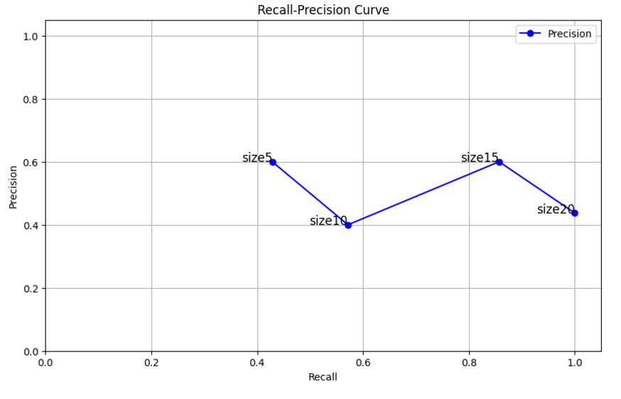

# INFO300.LabExercise 6--Scoring
Date: December 9, 2024

Student Name: __Qirui Zhang_  Class:__B_____ Email:__320220941080@lzu.edu.cn_


Notes:
+ Use your name to replace "suwei".
+ Run the following command and write the response of each command.
+ Answer the questions.

---

##  2). Task and Steps

### 2.2  Information Needs and Relevance Assessment:

#### 2.2.1 Use Case 1: Narrow Query Assessment (1 point)

Request:
```json
 GET /zhangqirui_papers/_search
 {
   "from" : 0, "size" : 3,
   "query": {
     "multi_match" : {
       "query": "environmental protection",
       "fields": [ "author", "title", "abstract" ]
     }
   }
 }
```

Response:
```json
{
  "took": 3,
  "timed_out": false,
  "_shards": {
    "total": 1,
    "successful": 1,
    "skipped": 0,
    "failed": 0
  },
  "hits": {
    "total": {
      "value": 4,
      "relation": "eq"
    },
    "max_score": 3.4454405,
    "hits": [
      {
        "_index": "zhangqirui_papers",
        "_id": "14",
        "_score": 3.4454405,
        "_source": {
          "author": "Weidner, T (Weidner, Till)",
          "title": "Energy optimisation of plant factories and greenhouses for different climatic conditions",
          "abstract": "The trend to localise food production promises reduced reliance on increasingly uncertain global supply chains. Controlled-environment agriculture, in particular indoor vertical farming, is developing as part of this trend, to ensure a year-round supply of healthy food and protection from extreme weather events. However, high energy consumption is a major concern that could greatly impact the environmental sustainability of high-tech farms. Addressing the lack of comprehensive comparisons between different controlled-environment agriculture systems on a consistent basis, this work investigates the favourability of indoor vertical farms (i.e. plant factories) over modern ventilated open and closed greenhouses from an energy intensity perspective. This was based on a flexible yield-energy model incorporating detailed air conditioning system dynamics, which was developed to evaluate the influence of outside climate conditions on energy consumption and vegetable yield. The model was used to optimise the climate control strategy and to minimise hourly specific energy consumption for multiple systems, parameter settings, and locations. The hourly model performance is demonstrated for Stockholm, which indicates that advanced climate control allows for very low-energy operations in summer compared to winter. The results show a strong parametric sensitivity for the thermal transmittance of the cover, the target light intensity and the crop climate preference in all three systems, as well as the efficiency of lighting and water cooling for plant factories. Considering the yearly average for multiple locations, open greenhouses were substantially more energy-efficient than plant factories in all ten locations (from -45% in Reykjavik to -94% in Gauteng). The option to ventilate a greenhouse (open vs closed) had the greatest positive effect on specific energy consumption in less extreme climates (from -36% in Massachusetts to -83% in Gauteng) but increased water consumption considerably (from an average of similar to 2 l/kg to 26 l/kg). Although local availability of land and water plays a significant role in the choice between growing systems, the results imply that high-tech ventilated greenhouses perform significantly better than vertical farms from an energy perspective in most inhabited regions of the planet.",
          "citations": 31
        }
      },
      {
        "_index": "zhangqirui_papers",
        "_id": "10",
        "_score": 2.310903,
        "_source": {
          "author": "Ng, KS (Ng, Kok Siew) ",
          "title": "Global biorenewable development strategies for sustainable aviation fuel production",
          "abstract": "Over the coming years, the world is projected to witness an upsurge in 'drop-in' aviation biofuel production as part of the renewable energy and bioeconomy developments. This paper presents a comprehensive review of the current status of biojet fuel development and uptake in global commercial aviation industry, including state-of-the-art certified technologies (i.e. Fischer-Tropsch (FT); hydroprocessed esters and fatty acids (HEFA); alcohol-to-jet (ATJ); and hydroprocessing of fermented sugars (HFS)); potential feedstock that can be deployed; a com-parison of techno-economic and environmental performances of biojet fuel production routes; airlines' commitment in promoting higher biofuel uptake; and global initiatives and policies. This review shows that the HEFA route using oil-based crops is best performing in terms of lowest production cost and greenhouse gas emissions, however it is in competition with the existing road transport biofuel market. Lignocellulosic biomass and waste feedstock should be promoted in view of replacing food/feed crops which have high indirect land use change emissions. Therefore, further improvement should be focused on FT, ATJ and HFS routes to enhance the cost effectiveness of biojet fuel production and promote commercialisation of these technologies. The selection of feedstock and technologies for SAF production should be justified based on production cost and environmental footprint, while avoiding competition with the existing road transport biofuel market. The shortcomings in the SAF policies such as blending mandate and multiplier in RED II should be addressed to reduce the negative impacts of feedstock competition between the road and aviation biofuel sectors and to meet the decarbonisation targets.",
          "citations": 116
        }
      },
      {
        "_index": "zhangqirui_papers",
        "_id": "3",
        "_score": 1.9597646,
        "_source": {
          "author": "Huo, JL (Huo, Jinlin)",
          "title": "Integrated network pharmacology and intestinal flora analysis to determine the protective effect of Xuanbai-Chengqi decoction on lung and gut injuries in influenza virus-infected mice",
          "abstract": "Ethnopharmacological relevance: Xuanbai-Chengqi decoction (XBCQ) is a traditional Chinese medicine (TCM) compound used in the treatment of pulmonary infection in China. Despite the popular usage of XBCQ, its underlying protective roles and the associated molecular mechanisms with the gut-lung axis in influenza remain unclear.Aim of the study: We aimed to explore the protective effects and the underlying mechanism of XBCQ efficacy on lung and intestine injuries induced by influenza A virus as well as to identify the main active components through integrated network pharmacology, intestinal flora analysis and pathway validation. Materials and methods: The potential active components and therapeutic targets of XBCQ in the treatment of influenza were hypothesized through a series of network pharmacological strategies, including components screening, targets prediction and bioinformatics analysis. Inflammatory cytokines and pathway proteins were assayed to validate the results of network pharmacology. Then the mechanism of XBCQ alleviating lung and intestine injuries was further explored via intestinal flora analysis. The important role of Rhubarb in the formula was verified by removing Rhubarb. Results: XBCQ could significantly improve the survival rate in IAV-infected mice. The network pharmacology results demonstrated that JUN, mitogen-activated protein kinase (MAPK), and tumor necrosis factor (TNF) are the key targets of XBCQ that can be useful in influenza treatment as it contains the core components luteolin, emodin, and aloe-emodin, which are related to the pathways of TNF, T-cell receptor (TCR), and NF-Kappa B. Verification experiments demonstrated that XBCQ could significantly alleviate the immune injury of the lungs and the gut of the mice, which is attributable to the inhibition of the release of inflammatory cytokines (such as TNF-alpha, IL-6, and IL-1 beta), the downregulation of the protein expression levels of Toll-like receptors-7 (TLR7), MyD88, and p-NF-Kappa B65, and the reduction in the relative abundance of Enterobacteriaceae and Proteus, while an increase in that of Firmicutes and Lachnospiraceae. The overall protective role of XBCQ contributing to the treatment of the lungs and the gut was impaired when Rhubarb was removed from XBCQ. Conclusions: Our results suggest that the efficacy of XBCQ is related to the inhibition of the immune injury and remodeling of the intestinal flora, wherein Rhubarb plays an important role, which cumulatively provide the evidence applicable for the treatment of viral pneumonia induced by a different respiratory virus with XBCQ.",
          "citations": 15
        }
      }
    ]
  }
}
```      


|                  Narrow Query                      |      
| Term   |          environmental protection         |      
|Description of the Information Needed| The field of articles I found that related to the issues of environmental protection |      
|--------|----------|---------|---------|---------|      
|Doc| Author  |          Title          |Relevant|      
|3  |Huo, JL (Huo, Jinlin)|Integrated network pharmacology and intestinal flora analysis to determine the protective effect of Xuanbai-Chengqi decoction on lung and gut injuries in influenza virus-infected mice|    0   |      
|10 |Ng, KS (Ng, Kok Siew)|Global biorenewable development strategies for sustainable aviation fuel production|    1   |     
|13 |Zhu, HH (Zhu, Huahe)|Mechanism of protective effect of xuan-bai-cheng-qi decoction on LPS-induced acute lung injury based on an integrated network pharmacology and RNA-sequencing approach|    0   |     
|14 |Weidner, T (Weidner, Till)|Energy optimisation of plant factories and greenhouses for different climatic conditions|    1   |     


#### 2.2.2 Broad Query Assessment (1 point)

Request:
```json
 GET /zhangqirui_papers/_search
 {
   "from" : 0,
   "query": {
     "multi_match" : {
       "query": "CO2",
       "fields": [ "author", "title", "abstract" ]
     }
   }
 }
```

Response:
```json
 GET /zhangqirui_papers/_search
 {
  "took": 2,
  "timed_out": false,
  "_shards": {
    "total": 1,
    "successful": 1,
    "skipped": 0,
    "failed": 0
  },
  "hits": {
    "total": {
      "value": 7,
      "relation": "eq"
    },
    "max_score": 3.0328693,
    "hits": [
      {
        "_index": "zhangqirui_papers",
        "_id": "8",
        "_score": 3.0328693,
        "_source": {
          "author": "Bullock, LA (Bullock, Liam A.)",
          "title": "Kinetics-informed global assessment of mine tailings for CO2 removal",
          "abstract": "Chemically reactive mine tailings are a potential resource for drawing down carbon dioxide out of the atmosphere in mineral weathering schemes. Such carbon dioxide removal (CDR) systems, applied on a large scale, could help to meet internationally agreed targets for minimising climate change, but crucially we need to identify what materials could react fast enough to provide CDR at relevant climate change mitigation timescales. This study focuses on a range of silicate-dominated tailings, calculating their CDR potential from their chemical composition (specific capacity), estimated global production rates, and the speed of weathering under different reaction conditions. Tailings containing high abundances of olivine, serpentine and diopsidc show the highest CDR potential due to their favourable kinetics. We conclude that the most suitable tailings for CDR purposes arc those associated with olivine dunites, diamond kimberlites, asbestos and talc serpentinites, Ni sulphides, and PGM layered mafic intrusions. We estimate the average annual global CDR potential of tailings weathered over the 70-year period 2030-2100 to be similar to 93 (unimproved conditions) to 465 (improved conditions) Mt/year. Results indicate that at least 30 countries possess tailings materials that, under improved conditions, may offer a route for CDR which is not currently utilised within the mining industry. By 2100, the total cumulative CDR could reach some 33 GtCO(2), of which more than 60% is contributed by PGM tailings produced in Southern Africa, Russia, and North America. The global CDR potential could be increased by utilization of historic tailings and implementing measures to further enhance chemical reaction rates. If practical considerations can be addressed and enhanced weathering rates can be achieved, then CDR from suitable tailings could contribute significantly to national offset goals and global targets. More research is needed to establish the potential and practicality of this technology, including measurements of the mineral weathering kinetics under various conditions.",
          "citations": 19
        }
      },
      {
        "_index": "zhangqirui_papers",
        "_id": "5",
        "_score": 1.4586254,
        "_source": {
          "author": "Xing, L (Xing, Lei)",
          "title": "Potential of enhanced weathering of calcite in packed bubble columns with seawater for carbon dioxide removal",
          "abstract": "Enhanced weathering of minerals is one option being considered for removing CO2 from the atmosphere to help combat climate change. In this work, we consider the weathering of calcite with seawater in a reactor using air enriched with CO2. A mathematical model of the packed bubble column reactor was constructed with the key mass transfer and chemical reaction components validated with experimental data. The modelling results for a continuous process reveal the performance in terms of the specific energy consumption and the CO2 capture rate, which are affected by parameters including particle size, superficial velocities of gas and liquid, reactor bed height and feed CO2 concentration. The major energy requirements are for pumping liquid and compressing gas, and for CO2 enrichment; energy needed for supplying solid particles (mining operations, transport and comminution) was found to be comparatively minor. A trade-off was possible between ground area requirement (determined by CO2 capture rate) and energy requirement. To capture 1 tonne of CO2 at the reactor, optimal designs were predicted to consume 2.1-2.3 GJ of electricity and occupy 1.8-5.2 m(2) year of space, depending on the feed CO2 concentration. These would increase to 5.7-8.2 GJ and 7.1-13.1 m(2) year per tonne of CO2 captured, after allowing for degassing of the weathering product in the ocean. This increased energy intensity is still within the range of the CO(2 )removal options previously reported, while the space requirement quantification provides essential information for future feasibility assessment of this scheme.",
          "citations": 11
        }
      },
      {
        "_index": "zhangqirui_papers",
        "_id": "17",
        "_score": 1.4274101,
        "_source": {
          "author": "Xing, L (Xing, Lei)",
          "title": "Enhanced weathering to capture atmospheric carbon dioxide: Modeling of a trickle-bed reactor",
          "abstract": "Enhanced weathering (EW) of alkaline minerals can potentially capture CO2 from the atmosphere at gigaton scale, but the reactor design presents great challenges. We model EW with fresh water in a counter-current trickle flow packed bed batch of 1-10 mm calcite particles. Weathering kinetics are integrated with the mass transfer of CO2 incorporating transfer enhancement by chemical reaction. To avoid flooding, flow rates must be reduced as the particles shrink due to EW. The capture rate is mainly limited by slow transfer of CO2 from gas to liquid although slow dissolution of calcite can also play a role in certain circumstances. A bed height of at least 7-8 m is required to provide sufficient residence time. The results highlight the need to improve capture rate and reduce energy and water consumption, possibly through enriching the feed with CO2 and further chemical acceleration of the mass transfer.",
          "citations": 12
        }
      },
      {
        "_index": "zhangqirui_papers",
        "_id": "19",
        "_score": 1.4227016,
        "_source": {
          "author": "Yang, ZM (Yang, Ziming)",
          "title": "Modeling and Upscaling Analysis of Gas Diffusion Electrode-Based Electrochemical Carbon Dioxide Reduction Systems",
          "abstract": "As an emerging technology for CO2 utilization, electrochemical CO2 reduction reaction (ECO2RR) systems incorporating gas diffusion electrodes (GDE) have the potential to transform CO2 to valuable products efficiently and environment-friendly. In this work, a two-dimensional multiphase model capturing the details of the catalyst layer in a GDE that produces formate with byproducts is established and quantitatively validated against experimental data. This model is capable of describing the mixture gas and aqueous species transportation, electron conduction processes, and a series of interrelated chemical and electrochemical reactions. Specific electrical energy consumption (SEEC) and product yield (PY) have been introduced and used to examine the GDE scalability and evaluate the system performance. The results predict the optimal values for applied cathode potential and catalyst loading and porosity. The effect of inlet gas composition and velocity is also evaluated. Moreover, this study predicts that the GDE is scalable as it retains a stable performance as its geometrical surface area varies. This model together with the simulation findings contributes to the improved understanding of GDE-based CO2 conversion as needed for the future development toward successful industrial applications.",
          "citations": 42
        }
      },
      {
        "_index": "zhangqirui_papers",
        "_id": "1",
        "_score": 1.3679914,
        "_source": {
          "author": "Williams, F (Williams, Franco)",
          "title": "Decarbonisation pathways of the cement production process via hydrogen and oxy-combustion",
          "abstract": "Decarbonising cement production is of profound importance for meeting global greenhouse gas emission reduction targets and mitigating the impact of climate change. This study evaluates various technical options for achieving deep decarbonisation in a clinker production facility by utilising hydrogen (H2) as an alternative fuel to replace fossil fuels and by integrating an oxy-combustion technique with carbon capture and storage (CCS). Using Aspen Plus process simulations, we examined the extent of decarbonisation and assessed the thermal and electrical energy demands. This was achieved by incorporating an amine-absorption-based CO2 capture to a conventional natural gas fuelled reference plant, implementing oxyfuel-combustion of natural gas, and exploring four different scenarios for replacing fossil fuel with H2. In these scenarios, H2 was assumed to be produced through on-site water electrolysis, which also supplied oxygen for oxyfuel combustion, potentially eliminating the need for an air separation unit (ASU). The processes utilizing H2, except for the case of indirectly heated precalcination, employed oxyfuel combustion. The results indicate that the natural gas-fuelled oxyfuel-combustion process had the lowest total energy input at 4.92 GJ/t clinker, approximately 35% lower than that of the reference plant. Processes using H2 reduced energy demand by 11% in the H2-d scenario and 33% in the H2-a scenario. However, the process with indirect calcination required 6.24 GJ/t clinker, about 8% more H2 fuel than direct calcination but helped eliminate the need for an ASU. The results also reveal that greater H2 substitutions led to higher total process energy requirements due to the inefficiencies of the electrolysis process. While the H2using processes could reduce the CO2 generation by up to 559 kgCO2/t clinker, this represents only about 27.6% of the CO2 reductions relative to the reference plant. These findings underscore the limitation of fuel substitution alone in cement production and emphasize the need for innovations in raw materials and the adoption of CCS to achieve deeper decarbonisation in cement industries.",
          "citations": 6
        }
      },
      {
        "_index": "zhangqirui_papers",
        "_id": "7",
        "_score": 1.2973679,
        "_source": {
          "author": "Devlin, A (Devlin, Alexandra)",
          "title": "Regional supply chains for decarbonising steel: Energy efficiency and green premium mitigation",
          "abstract": "Decarbonised steel, enabled by green hydrogen-based iron ore reduction and renewable electricity-based steel making, will disrupt the traditional supply chain. Focusing on the energetic and techno-economic assessment of potential green supply chains, this study investigates the direct reduced iron-electric arc furnace production route enabled by renewable energy and deployed in regional settings. The hypothesis, that co-locating manufacturing processes with renewable energy resources would offer highest energy efficiency and cost reduction, is tested through an Australia-Japan case study. The binational partnership is structured to meet Japanese steel demand (for domestic use and regional exports) and source both energy and iron ore from the Pilbara region of Western Australia. A total of 12 unique supply chains differentiated by spatial configuration, timeline and energy carrier were simulated, which validated the hypothesis: direct energy and ore exports to remote steel producers (i.e. Japan-based production), as opposed to co-locating iron and steel production with abundant ore and renewable energy resources (i.e. Australia-based production), increased energy consumption and the levelised cost of steel by 45% and 32%, respectively, when averaged across 2030 and 2050. Two decades of technological development and economies of scale realisation would be crucial; 2030 supply chains were on average 12% more energy-intense and 23% more expensive than 2050 equivalents. On energy vectors, liquefied hydrogen was more efficient than ammonia for export-dominant supply chains due to the pairing of its process flexibility and the intermittent solar energy profile, as well as the avoidance of the need for ammonia cracking prior to direct reduction. To mitigate the green premium, a carbon tax in the range of A$66-192/t CO2 would be required in 2030 and A$0-70/t CO2 in 2050; the diminished carbon tax requirement in the latter is achievable only by wholly Australia-based production. Further, the modelled system scale was immense; producing 40 Mtpa of decarbonised steel will require 74-129% of Australia's current electricity output and A$137-328 billion in capital investment for solar power, production, and shipping vessel infrastructure. These results call for strategic planning of regional resource pairing to drive energy and cost efficiencies which accelerate the global decar-bonisation of steel.",
          "citations": 31
        }
      },
      {
        "_index": "zhangqirui_papers",
        "_id": "2",
        "_score": 1.2409092,
        "_source": {
          "author": "Devlin, A (Devlin, Alexandra)",
          "title": "Global green hydrogen-based steel opportunities surrounding high quality renewable energy and iron ore deposits",
          "abstract": "Facility-level analysis of green H2- based steel production demonstrates co-location of high-quality renewables and iron ore resources is imperative for cost minimisation.  The steel sector currently accounts for 7% of global energy-related CO2 emissions and requires deep reform to disconnect from fossil fuels. Here, we investigate the market competitiveness of one of the widely considered decarbonisation routes for primary steel production: green hydrogen-based direct reduction of iron ore followed by electric arc furnace steelmaking. Through analysing over 300 locations by combined use of optimisation and machine learning, we show that competitive renewables-based steel production is located nearby the tropic of Capricorn and Cancer, characterised by superior solar with supplementary onshore wind, in addition to high-quality iron ore and low steelworker wages. If coking coal prices remain high, fossil-free steel could attain competitiveness in favourable locations from 2030, further improving towards 2050. Large-scale implementation requires attention to the abundance of suitable iron ore and other resources such as land and water, technical challenges associated with direct reduction, and future supply chain configuration.",
          "citations": 47
        }
      }
    ]
  }
}
```     


|                  Broad Query                      |     
| Term   |                  CO2                     |
|Description of the Information Needed| Articles related to CO2 |       
|--------|----------|---------|---------|---------|      
|Doc| Author  |          Title          |Relevant|      
|1  |Williams, F (Williams, Franco)|Decarbonisation pathways of the cement production process via hydrogen and oxy-combustion|    1   |      
|2  |Devlin, A (Devlin, Alexandra)|Global green hydrogen-based steel opportunities surrounding high quality renewable energy and iron ore deposits|    0   |      
|3  |Huo, JL (Huo, Jinlin)|Integrated network pharmacology and intestinal flora analysis to determine the protective effect of Xuanbai-Chengqi decoction on lung and gut injuries in influenza virus-infected mice|    1   |      
|5  |Xing, L (Xing, Lei)|Potential of enhanced weathering of calcite in packed bubble columns with seawater for carbon dioxide removal|    1   |      
|7  |Devlin, A (Devlin, Alexandra)|Regional supply chains for decarbonising steel: Energy efficiency and green premium mitigation|    0   |      
|8  |Bullock, LA (Bullock, Liam A.)|Kinetics-informed global assessment of mine tailings for CO2 removal|    1   |      
|10 |Ng, KS (Ng, Kok Siew)|Global biorenewable development strategies for sustainable aviation fuel production|    1   |     
|14 |Weidner, T (Weidner, Till)|Energy optimisation of plant factories and greenhouses for different climatic conditions|    1   |       
|17 |Xing, L (Xing, Lei)|Enhanced weathering to capture atmospheric carbon dioxide: Modeling of a trickle-bed reactor|    0   |      
|19 |Yang, ZM (Yang, Ziming)|Modeling and Upscaling Analysis of Gas Diffusion Electrode-Based Electrochemical Carbon Dioxide Reduction Systems|    0   |      


#### 2.2.3 Broad Query Assessment (1 point)

Request:
```json
  GET /zhangqirui_articles/_search
 {
   "from" : 0, "size" : 3,
   "query": {
     "multi_match" : {
       "query": "Wu, SB (Wu, Shengbo) CO2",
       "fields": [ "author", "title", "abstract" ]
     }
   }
 }
```

Response:
```json
{
  "took": 3,
  "timed_out": false,
  "_shards": {
    "total": 1,
    "successful": 1,
    "skipped": 0,
    "failed": 0
  },
  "hits": {
    "total": {
      "value": 10,
      "relation": "eq"
    },
    "max_score": 8.036458,
    "hits": [
      {
        "_index": "zhangqirui_articles",
        "_id": "4",
        "_score": 8.036458,
        "_source": {
          "author": "Wu, SB (Wu, Shengbo)",
          "title": "Machine learning aided construction of the quorum sensing communication network for human gut microbiota",
          "abstract": "Quorum sensing (QS) is a cell-cell communication mechanism that connects members in various microbial systems. Conventionally, a small number of QS entries are collected for specific microbes, which is far from being able to fully depict communication-based complex microbial interactions in human gut microbiota. In this study, we propose a systematic workflow including three modules and the use of machine learning-based classifiers to collect, expand, and mine the QS-related entries. Furthermore, we develop the Quorum Sensing of Human Gut Microbes (QSHGM) database (http://www.qshgm.lbci.net/) including 28,567 redundancy removal entries, to bridge the gap between QS repositories and human gut microbiota. With the help of QSHGM, various communication-based microbial interactions can be searched and a QS communication network (QSCN) is further constructed and analysed for 818 human gut microbes. This work contributes to the establishment of the QSCN which may form one of the key knowledge maps of the human gut microbiota, supporting future applications such as new manipulations to synthetic microbiota and potential therapies to gut diseases.",
          "citations": 32
        }
      },
      {
        "_index": "zhangqirui_articles",
        "_id": "12",
        "_score": 8.036458,
        "_source": {
          "author": "Wu, SB (Wu, Shengbo)",
          "title": "QSIdb: quorum sensing interference molecules",
          "abstract": "Quorum sensing interference (QSI), the disruption and manipulation of quorum sensing (QS) in the dynamic control of bacteria populations could be widely applied in synthetic biology to realize dynamic metabolic control and develop potential clinical therapies. Conventionally, limited QSI molecules (QSIMs) were developed based on molecular structures or for specific QS receptors, which are in short supply for various interferences and manipulations of QS systems. In this study, we developed QSIdb (http://qsidb.lbci.net/), a specialized repository of 633 reported QSIMs and 73 073 expanded QSIMs including both QS agonists and antagonists. We have collected all reported QSIMs in literatures focused on the modifications of N-acyl homoserine lactones, natural QSIMs and synthetic QS analogues. Moreover, we developed a pipeline with SMILES-based similarity assessment algorithms and docking-based validations to mine potential QSIMs from existing 138 805 608 compounds in the PubChem database. In addition, we proposed a new measure, pocketedit, for assessing the similarities of active protein pockets or QSIMs crosstalk, and obtained 273 possible potential broad-spectrum QSIMs. We provided user-friendly browsing and searching facilities for easy data retrieval and comparison. QSIdb could assist the scientific community in understanding QS-related therapeutics, manipulating QS-based genetic circuits in metabolic engineering, developing potential broad-spectrum QSIMs and expanding new ligands for other receptors.",
          "citations": 9
        }
      },
      {
        "_index": "zhangqirui_articles",
        "_id": "11",
        "_score": 8.036458,
        "_source": {
          "author": "Wu, SB (Wu, Shengbo)",
          "title": "Combinational quorum sensing devices for dynamic control in cross-feeding cocultivation",
          "abstract": "Quorum sensing (QS) offers cell density dependent dynamic regulations in cell culture through devices such as synchronized lysis circuit (SLC) and metabolic toggle switch (MTS). However, there is still a lack of studies on cocultivation with a combination of different QS-based devices. Taking the production of isopropanol and salidroside as case studies, we have mathematically modeled a comprehensive set of QS-regulated cocultivation schemes and constructed experimental combinations of QS devices, respectively, to evaluate their feasibility and optimality for regulating growth competition and corporative production. Glucose split ratio is proposed for the analysis of competition between cell growth and targeted production. Results show that the combination of different QS devices across multiple members offers a new tool with the potential to effectively coordinate synthetic microbial consortia for achieving high product titer in cross-feeding cocultivation. It is also evident that the performance of such systems is significantly affected by dynamic characteristics of chosen QS devices, carbon source control and the operational settings. This study offers insights for future applications of combinational QS devices in synthetic microbial consortia.",
          "citations": 14
        }
      }
    ]
  }
}
```     


|                  Author plus Broad Query                      |      
| Term   |         Wu, SB (Wu, Shengbo) CO2                  |
|Description of the Information Needed| Articles related to CO2 |      
|--------|----------|---------|---------|---------|      
|Doc| Author  |          Title          |Relevant|      
|1  |Williams, F (Williams, Franco)|Decarbonisation pathways of the cement production process via hydrogen and oxy-combustion|    1   |      
|2  |Devlin, A (Devlin, Alexandra)|Global green hydrogen-based steel opportunities surrounding high quality renewable energy and iron ore deposits|    0   |      
|4  |Wu, SB (Wu, Shengbo)|Machine learning aided construction of the quorum sensing communication network for human gut microbiota|    1   |      
|5  |Xing, L (Xing, Lei)|Potential of enhanced weathering of calcite in packed bubble columns with seawater for carbon dioxide removal|    1   |      
|7  |Devlin, A (Devlin, Alexandra)|Regional supply chains for decarbonising steel: Energy efficiency and green premium mitigation|    0   |      
|8  |Bullock, LA (Bullock, Liam A.)|Kinetics-informed global assessment of mine tailings for CO2 removal|    0   |      
|11 |Wu, SB (Wu, Shengbo)|Combinational quorum sensing devices for dynamic control in cross-feeding cocultivation|    0   |      
|12 |Wu, SB (Wu, Shengbo)|QSIdb: quorum sensing interference molecules|    0   |      
|17 |Xing, L (Xing, Lei)|Enhanced weathering to capture atmospheric carbon dioxide: Modeling of a trickle-bed reactor|    0   |      
|19 |Yang, ZM (Yang, Ziming)|Modeling and Upscaling Analysis of Gas Diffusion Electrode-Based Electrochemical Carbon Dioxide Reduction Systems|    0   |     


## 3). Search Result Evaluation

### 3.1 Use Case 1: Basic Evaluation (1 point)

Results (top 3) in table:

| Doc ID | Author             | Title                                 | Score |
|--------|--------------------|---------------------------------------|-------|
|   14   |Weidner, T (Weidner, Till)|Energy optimisation of plant factories and greenhouses for different climatic conditions|3.0993161|      
|   10   |Ng, KS (Ng, Kok Siew)|Global biorenewable development strategies for sustainable aviation fuel production|2.7277792|      
|    3   |Huo, JL (Huo, Jinlin)|Integrated network pharmacology and intestinal flora analysis to determine the protective effect of Xuanbai-Chengqi decoction on lung and gut injuries in influenza virus-infected mice|2.1660666|       


|       -      |  Relevant   | Non-relevant |         
| Retrieved   |      2      |       1      |         
|Not Retrieved|      2      |       15     |         

$ Precision=\frac{TP}{TP+FP}=\frac{2}{3}$   
$ Recall=\frac{TP}{TP+FN}=\frac{1}{2} $   
$ F_1=2*\frac{precision*recall}{precision+recall}=\frac{4}{7}$   


###  3.2 Use Case 2: Precision and Recall Curve (2 points)

Request:
```json
  GET /zhangqirui_articles/_search
 {
   "from" : 0, "size" : 5,
   "query": {
     "multi_match" : {
       "query": "CO2",
       "fields": [ "author", "title", "abstract" ]
     }
   }
 }
```
|                  Broad Query                      |
| Term   |                  CO2                     |
|Description of the Information Needed| Articles related to CO2 |     
|--------|----------|---------|---------|---------|     
|Doc| Author  |          Title          |Relevant|    
|1  |Williams, F (Williams, Franco)|Decarbonisation pathways of the cement production process via hydrogen and oxy-combustion|    1   |      
|2  |Devlin, A (Devlin, Alexandra)|Global green hydrogen-based steel opportunities surrounding high quality renewable energy and iron ore deposits|    0   |      
|3  |Huo, JL (Huo, Jinlin)|Integrated network pharmacology and intestinal flora analysis to determine the protective effect of Xuanbai-Chengqi decoction on lung and gut injuries in influenza virus-infected mice|    1   |      
|5  |Xing, L (Xing, Lei)|Potential of enhanced weathering of calcite in packed bubble columns with seawater for carbon dioxide removal|    1   |      
|7  |Devlin, A (Devlin, Alexandra)|Regional supply chains for decarbonising steel: Energy efficiency and green premium mitigation|    0   |       
|8  |Bullock, LA (Bullock, Liam A.)|Kinetics-informed global assessment of mine tailings for CO2 removal|    1   |     
|10 |Ng, KS (Ng, Kok Siew)|Global biorenewable development strategies for sustainable aviation fuel production|    1   |     
|14 |Weidner, T (Weidner, Till)|Energy optimisation of plant factories and greenhouses for different climatic conditions|    1   |    
|17 |Xing, L (Xing, Lei)|Enhanced weathering to capture atmospheric carbon dioxide: Modeling of a trickle-bed reactor|    0   |    
|19 |Yang, ZM (Yang, Ziming)|Modeling and Upscaling Analysis of Gas Diffusion Electrode-Based Electrochemical Carbon Dioxide Reduction Systems|    0   |   
 


size5:
|             |  Relevant   | Non-relevant |   
| Retrieved   |      3      |       2      |   
|Not Retrieved|      4      |       11     |   

$ Precision=\frac{TP}{TP+FP}=\frac{3}{5}$     
$ Recall=\frac{TP}{TP+FN}=\frac{3}{7}$     
$ F_1=2*\frac{precision*recall}{precision+recall}=\frac{3}{11}$   

size10:    
|-------------|-------------|--------------|     
|             |  Relevant   | Non-relevant |    
| Retrieved   |      4      |       6      |    
|Not Retrieved|      3      |       7     |     

$ Precision=\frac{TP}{TP+FP}=\frac{2}{5}$   
$ Recall=\frac{TP}{TP+FN}=\frac{4}{7} $   
$ F_1=2*\frac{precision*recall}{precision+recall}=\frac{4}{19}$   

size15:    
|-------------|-------------|--------------|     
|             |  Relevant   | Non-relevant |    
| Retrieved   |      6      |       9      |    
|Not Retrieved|      1      |       4      |     

$ Precision=\frac{TP}{TP+FP}=\frac{3}{5}$   
$ Recall=\frac{TP}{TP+FN}=\frac{6}{7} $   
$ F_1=2*\frac{precision*recall}{precision+recall}=\frac{9}{28}$   

size20:    
|-------------|-------------|--------------|     
|             |  Relevant   | Non-relevant |    
| Retrieved   |      7      |       9     |    
|Not Retrieved|      0      |       4     |     

$ Precision=\frac{TP}{TP+FP}=\frac{7}{16}$   
$ Recall=\frac{TP}{TP+FN}=1 $   
$ F_1=2*\frac{precision*recall}{precision+recall}=\frac{7}{23}$   

  

After comparing the my precision-recall curve with the example curve, I found that the example curve got a better performance   

###  3.3.  Use Case 3: Rank Evaluation and Comparison (2 points)  

```json
GET /zhangqirui_articles/_search
 {
   "from" : 0,
   "query": {
     "multi_match" : {
       "query": "Wu, SB (Wu, Shengbo) CO2",
       "fields": [ "author", "title", "abstract" ]
     }
   }
 }
```

```json
{
  "took": 3,
  "timed_out": false,
  "_shards": {
    "total": 1,
    "successful": 1,
    "skipped": 0,
    "failed": 0
  },
  "hits": {
    "total": {
      "value": 10,
      "relation": "eq"
    },
    "max_score": 8.036458,
    "hits": [
      {
        "_index": "zhangqirui_articles",
        "_id": "4",
        "_score": 8.036458,
        "_source": {
          "author": "Wu, SB (Wu, Shengbo)",
          "title": "Machine learning aided construction of the quorum sensing communication network for human gut microbiota",
          "abstract": "Quorum sensing (QS) is a cell-cell communication mechanism that connects members in various microbial systems. Conventionally, a small number of QS entries are collected for specific microbes, which is far from being able to fully depict communication-based complex microbial interactions in human gut microbiota. In this study, we propose a systematic workflow including three modules and the use of machine learning-based classifiers to collect, expand, and mine the QS-related entries. Furthermore, we develop the Quorum Sensing of Human Gut Microbes (QSHGM) database (http://www.qshgm.lbci.net/) including 28,567 redundancy removal entries, to bridge the gap between QS repositories and human gut microbiota. With the help of QSHGM, various communication-based microbial interactions can be searched and a QS communication network (QSCN) is further constructed and analysed for 818 human gut microbes. This work contributes to the establishment of the QSCN which may form one of the key knowledge maps of the human gut microbiota, supporting future applications such as new manipulations to synthetic microbiota and potential therapies to gut diseases.",
          "citations": 32
        }
      },
      {
        "_index": "zhangqirui_articles",
        "_id": "12",
        "_score": 8.036458,
        "_source": {
          "author": "Wu, SB (Wu, Shengbo)",
          "title": "QSIdb: quorum sensing interference molecules",
          "abstract": "Quorum sensing interference (QSI), the disruption and manipulation of quorum sensing (QS) in the dynamic control of bacteria populations could be widely applied in synthetic biology to realize dynamic metabolic control and develop potential clinical therapies. Conventionally, limited QSI molecules (QSIMs) were developed based on molecular structures or for specific QS receptors, which are in short supply for various interferences and manipulations of QS systems. In this study, we developed QSIdb (http://qsidb.lbci.net/), a specialized repository of 633 reported QSIMs and 73 073 expanded QSIMs including both QS agonists and antagonists. We have collected all reported QSIMs in literatures focused on the modifications of N-acyl homoserine lactones, natural QSIMs and synthetic QS analogues. Moreover, we developed a pipeline with SMILES-based similarity assessment algorithms and docking-based validations to mine potential QSIMs from existing 138 805 608 compounds in the PubChem database. In addition, we proposed a new measure, pocketedit, for assessing the similarities of active protein pockets or QSIMs crosstalk, and obtained 273 possible potential broad-spectrum QSIMs. We provided user-friendly browsing and searching facilities for easy data retrieval and comparison. QSIdb could assist the scientific community in understanding QS-related therapeutics, manipulating QS-based genetic circuits in metabolic engineering, developing potential broad-spectrum QSIMs and expanding new ligands for other receptors.",
          "citations": 9
        }
      },
      {
        "_index": "zhangqirui_articles",
        "_id": "11",
        "_score": 8.036458,
        "_source": {
          "author": "Wu, SB (Wu, Shengbo)",
          "title": "Combinational quorum sensing devices for dynamic control in cross-feeding cocultivation",
          "abstract": "Quorum sensing (QS) offers cell density dependent dynamic regulations in cell culture through devices such as synchronized lysis circuit (SLC) and metabolic toggle switch (MTS). However, there is still a lack of studies on cocultivation with a combination of different QS-based devices. Taking the production of isopropanol and salidroside as case studies, we have mathematically modeled a comprehensive set of QS-regulated cocultivation schemes and constructed experimental combinations of QS devices, respectively, to evaluate their feasibility and optimality for regulating growth competition and corporative production. Glucose split ratio is proposed for the analysis of competition between cell growth and targeted production. Results show that the combination of different QS devices across multiple members offers a new tool with the potential to effectively coordinate synthetic microbial consortia for achieving high product titer in cross-feeding cocultivation. It is also evident that the performance of such systems is significantly affected by dynamic characteristics of chosen QS devices, carbon source control and the operational settings. This study offers insights for future applications of combinational QS devices in synthetic microbial consortia.",
          "citations": 14
        }
      },
      {
        "_index": "zhangqirui_articles",
        "_id": "8",
        "_score": 3.1649363,
        "_source": {
          "author": "Bullock, LA (Bullock, Liam A.)",
          "title": "Kinetics-informed global assessment of mine tailings for CO2 removal",
          "abstract": "Chemically reactive mine tailings are a potential resource for drawing down carbon dioxide out of the atmosphere in mineral weathering schemes. Such carbon dioxide removal (CDR) systems, applied on a large scale, could help to meet internationally agreed targets for minimising climate change, but crucially we need to identify what materials could react fast enough to provide CDR at relevant climate change mitigation timescales. This study focuses on a range of silicate-dominated tailings, calculating their CDR potential from their chemical composition (specific capacity), estimated global production rates, and the speed of weathering under different reaction conditions. Tailings containing high abundances of olivine, serpentine and diopsidc show the highest CDR potential due to their favourable kinetics. We conclude that the most suitable tailings for CDR purposes arc those associated with olivine dunites, diamond kimberlites, asbestos and talc serpentinites, Ni sulphides, and PGM layered mafic intrusions. We estimate the average annual global CDR potential of tailings weathered over the 70-year period 2030-2100 to be similar to 93 (unimproved conditions) to 465 (improved conditions) Mt/year. Results indicate that at least 30 countries possess tailings materials that, under improved conditions, may offer a route for CDR which is not currently utilised within the mining industry. By 2100, the total cumulative CDR could reach some 33 GtCO(2), of which more than 60% is contributed by PGM tailings produced in Southern Africa, Russia, and North America. The global CDR potential could be increased by utilization of historic tailings and implementing measures to further enhance chemical reaction rates. If practical considerations can be addressed and enhanced weathering rates can be achieved, then CDR from suitable tailings could contribute significantly to national offset goals and global targets. More research is needed to establish the potential and practicality of this technology, including measurements of the mineral weathering kinetics under various conditions.",
          "citations": 19
        }
      },
      {
        "_index": "zhangqirui_articles",
        "_id": "5",
        "_score": 2.559362,
        "_source": {
          "author": "Xing, L (Xing, Lei)",
          "title": "Potential of enhanced weathering of calcite in packed bubble columns with seawater for carbon dioxide removal",
          "abstract": "Enhanced weathering of minerals is one option being considered for removing CO2 from the atmosphere to help combat climate change. In this work, we consider the weathering of calcite with seawater in a reactor using air enriched with CO2. A mathematical model of the packed bubble column reactor was constructed with the key mass transfer and chemical reaction components validated with experimental data. The modelling results for a continuous process reveal the performance in terms of the specific energy consumption and the CO2 capture rate, which are affected by parameters including particle size, superficial velocities of gas and liquid, reactor bed height and feed CO2 concentration. The major energy requirements are for pumping liquid and compressing gas, and for CO2 enrichment; energy needed for supplying solid particles (mining operations, transport and comminution) was found to be comparatively minor. A trade-off was possible between ground area requirement (determined by CO2 capture rate) and energy requirement. To capture 1 tonne of CO2 at the reactor, optimal designs were predicted to consume 2.1-2.3 GJ of electricity and occupy 1.8-5.2 m(2) year of space, depending on the feed CO2 concentration. These would increase to 5.7-8.2 GJ and 7.1-13.1 m(2) year per tonne of CO2 captured, after allowing for degassing of the weathering product in the ocean. This increased energy intensity is still within the range of the CO(2 )removal options previously reported, while the space requirement quantification provides essential information for future feasibility assessment of this scheme.",
          "citations": 11
        }
      },
      {
        "_index": "zhangqirui_articles",
        "_id": "17",
        "_score": 2.3954537,
        "_source": {
          "author": "Xing, L (Xing, Lei)",
          "title": "Enhanced weathering to capture atmospheric carbon dioxide: Modeling of a trickle-bed reactor",
          "abstract": "Enhanced weathering (EW) of alkaline minerals can potentially capture CO2 from the atmosphere at gigaton scale, but the reactor design presents great challenges. We model EW with fresh water in a counter-current trickle flow packed bed batch of 1-10 mm calcite particles. Weathering kinetics are integrated with the mass transfer of CO2 incorporating transfer enhancement by chemical reaction. To avoid flooding, flow rates must be reduced as the particles shrink due to EW. The capture rate is mainly limited by slow transfer of CO2 from gas to liquid although slow dissolution of calcite can also play a role in certain circumstances. A bed height of at least 7-8 m is required to provide sufficient residence time. The results highlight the need to improve capture rate and reduce energy and water consumption, possibly through enriching the feed with CO2 and further chemical acceleration of the mass transfer.",
          "citations": 12
        }
      },
      {
        "_index": "zhangqirui_articles",
        "_id": "19",
        "_score": 2.3577585,
        "_source": {
          "author": "Yang, ZM (Yang, Ziming)",
          "title": "Modeling and Upscaling Analysis of Gas Diffusion Electrode-Based Electrochemical Carbon Dioxide Reduction Systems",
          "abstract": "As an emerging technology for CO2 utilization, electrochemical CO2 reduction reaction (ECO2RR) systems incorporating gas diffusion electrodes (GDE) have the potential to transform CO2 to valuable products efficiently and environment-friendly. In this work, a two-dimensional multiphase model capturing the details of the catalyst layer in a GDE that produces formate with byproducts is established and quantitatively validated against experimental data. This model is capable of describing the mixture gas and aqueous species transportation, electron conduction processes, and a series of interrelated chemical and electrochemical reactions. Specific electrical energy consumption (SEEC) and product yield (PY) have been introduced and used to examine the GDE scalability and evaluate the system performance. The results predict the optimal values for applied cathode potential and catalyst loading and porosity. The effect of inlet gas composition and velocity is also evaluated. Moreover, this study predicts that the GDE is scalable as it retains a stable performance as its geometrical surface area varies. This model together with the simulation findings contributes to the improved understanding of GDE-based CO2 conversion as needed for the future development toward successful industrial applications.",
          "citations": 42
        }
      },
      {
        "_index": "zhangqirui_articles",
        "_id": "1",
        "_score": 1.988427,
        "_source": {
          "author": "Williams, F (Williams, Franco)",
          "title": "Decarbonisation pathways of the cement production process via hydrogen and oxy-combustion",
          "abstract": "Decarbonising cement production is of profound importance for meeting global greenhouse gas emission reduction targets and mitigating the impact of climate change. This study evaluates various technical options for achieving deep decarbonisation in a clinker production facility by utilising hydrogen (H2) as an alternative fuel to replace fossil fuels and by integrating an oxy-combustion technique with carbon capture and storage (CCS). Using Aspen Plus process simulations, we examined the extent of decarbonisation and assessed the thermal and electrical energy demands. This was achieved by incorporating an amine-absorption-based CO2 capture to a conventional natural gas fuelled reference plant, implementing oxyfuel-combustion of natural gas, and exploring four different scenarios for replacing fossil fuel with H2. In these scenarios, H2 was assumed to be produced through on-site water electrolysis, which also supplied oxygen for oxyfuel combustion, potentially eliminating the need for an air separation unit (ASU). The processes utilizing H2, except for the case of indirectly heated precalcination, employed oxyfuel combustion. The results indicate that the natural gas-fuelled oxyfuel-combustion process had the lowest total energy input at 4.92 GJ/t clinker, approximately 35% lower than that of the reference plant. Processes using H2 reduced energy demand by 11% in the H2-d scenario and 33% in the H2-a scenario. However, the process with indirect calcination required 6.24 GJ/t clinker, about 8% more H2 fuel than direct calcination but helped eliminate the need for an ASU. The results also reveal that greater H2 substitutions led to higher total process energy requirements due to the inefficiencies of the electrolysis process. While the H2using processes could reduce the CO2 generation by up to 559 kgCO2/t clinker, this represents only about 27.6% of the CO2 reductions relative to the reference plant. These findings underscore the limitation of fuel substitution alone in cement production and emphasize the need for innovations in raw materials and the adoption of CCS to achieve deeper decarbonisation in cement industries.",
          "citations": 6
        }
      },
      {
        "_index": "zhangqirui_articles",
        "_id": "7",
        "_score": 1.6118066,
        "_source": {
          "author": "Devlin, A (Devlin, Alexandra)",
          "title": "Regional supply chains for decarbonising steel: Energy efficiency and green premium mitigation",
          "abstract": "Decarbonised steel, enabled by green hydrogen-based iron ore reduction and renewable electricity-based steel making, will disrupt the traditional supply chain. Focusing on the energetic and techno-economic assessment of potential green supply chains, this study investigates the direct reduced iron-electric arc furnace production route enabled by renewable energy and deployed in regional settings. The hypothesis, that co-locating manufacturing processes with renewable energy resources would offer highest energy efficiency and cost reduction, is tested through an Australia-Japan case study. The binational partnership is structured to meet Japanese steel demand (for domestic use and regional exports) and source both energy and iron ore from the Pilbara region of Western Australia. A total of 12 unique supply chains differentiated by spatial configuration, timeline and energy carrier were simulated, which validated the hypothesis: direct energy and ore exports to remote steel producers (i.e. Japan-based production), as opposed to co-locating iron and steel production with abundant ore and renewable energy resources (i.e. Australia-based production), increased energy consumption and the levelised cost of steel by 45% and 32%, respectively, when averaged across 2030 and 2050. Two decades of technological development and economies of scale realisation would be crucial; 2030 supply chains were on average 12% more energy-intense and 23% more expensive than 2050 equivalents. On energy vectors, liquefied hydrogen was more efficient than ammonia for export-dominant supply chains due to the pairing of its process flexibility and the intermittent solar energy profile, as well as the avoidance of the need for ammonia cracking prior to direct reduction. To mitigate the green premium, a carbon tax in the range of A$66-192/t CO2 would be required in 2030 and A$0-70/t CO2 in 2050; the diminished carbon tax requirement in the latter is achievable only by wholly Australia-based production. Further, the modelled system scale was immense; producing 40 Mtpa of decarbonised steel will require 74-129% of Australia's current electricity output and A$137-328 billion in capital investment for solar power, production, and shipping vessel infrastructure. These results call for strategic planning of regional resource pairing to drive energy and cost efficiencies which accelerate the global decar-bonisation of steel.",
          "citations": 31
        }
      },
      {
        "_index": "zhangqirui_articles",
        "_id": "2",
        "_score": 1.4721197,
        "_source": {
          "author": "Devlin, A (Devlin, Alexandra)",
          "title": "Global green hydrogen-based steel opportunities surrounding high quality renewable energy and iron ore deposits",
          "abstract": "Facility-level analysis of green H2- based steel production demonstrates co-location of high-quality renewables and iron ore resources is imperative for cost minimisation.  The steel sector currently accounts for 7% of global energy-related CO2 emissions and requires deep reform to disconnect from fossil fuels. Here, we investigate the market competitiveness of one of the widely considered decarbonisation routes for primary steel production: green hydrogen-based direct reduction of iron ore followed by electric arc furnace steelmaking. Through analysing over 300 locations by combined use of optimisation and machine learning, we show that competitive renewables-based steel production is located nearby the tropic of Capricorn and Cancer, characterised by superior solar with supplementary onshore wind, in addition to high-quality iron ore and low steelworker wages. If coking coal prices remain high, fossil-free steel could attain competitiveness in favourable locations from 2030, further improving towards 2050. Large-scale implementation requires attention to the abundance of suitable iron ore and other resources such as land and water, technical challenges associated with direct reduction, and future supply chain configuration.",
          "citations": 47
        }
      }
    ]
  }
}
```

```json
  GET /zhangqirui_articles/_search
 {
   "from" : 0,
   "query": {
     "multi_match" : {
       "query": "Wu, SB (Wu, Shengbo) CO2",
       "fields": [ "author^3", "title", "abstract" ]
     }
   }
 }
```

```json
{
  "took": 2,
  "timed_out": false,
  "_shards": {
    "total": 1,
    "successful": 1,
    "skipped": 0,
    "failed": 0
  },
  "hits": {
    "total": {
      "value": 10,
      "relation": "eq"
    },
    "max_score": 24.109375,
    "hits": [
      {
        "_index": "zhangqirui_articles",
        "_id": "4",
        "_score": 24.109375,
        "_source": {
          "author": "Wu, SB (Wu, Shengbo)",
          "title": "Machine learning aided construction of the quorum sensing communication network for human gut microbiota",
          "abstract": "Quorum sensing (QS) is a cell-cell communication mechanism that connects members in various microbial systems. Conventionally, a small number of QS entries are collected for specific microbes, which is far from being able to fully depict communication-based complex microbial interactions in human gut microbiota. In this study, we propose a systematic workflow including three modules and the use of machine learning-based classifiers to collect, expand, and mine the QS-related entries. Furthermore, we develop the Quorum Sensing of Human Gut Microbes (QSHGM) database (http://www.qshgm.lbci.net/) including 28,567 redundancy removal entries, to bridge the gap between QS repositories and human gut microbiota. With the help of QSHGM, various communication-based microbial interactions can be searched and a QS communication network (QSCN) is further constructed and analysed for 818 human gut microbes. This work contributes to the establishment of the QSCN which may form one of the key knowledge maps of the human gut microbiota, supporting future applications such as new manipulations to synthetic microbiota and potential therapies to gut diseases.",
          "citations": 32
        }
      },
      {
        "_index": "zhangqirui_articles",
        "_id": "12",
        "_score": 24.109375,
        "_source": {
          "author": "Wu, SB (Wu, Shengbo)",
          "title": "QSIdb: quorum sensing interference molecules",
          "abstract": "Quorum sensing interference (QSI), the disruption and manipulation of quorum sensing (QS) in the dynamic control of bacteria populations could be widely applied in synthetic biology to realize dynamic metabolic control and develop potential clinical therapies. Conventionally, limited QSI molecules (QSIMs) were developed based on molecular structures or for specific QS receptors, which are in short supply for various interferences and manipulations of QS systems. In this study, we developed QSIdb (http://qsidb.lbci.net/), a specialized repository of 633 reported QSIMs and 73 073 expanded QSIMs including both QS agonists and antagonists. We have collected all reported QSIMs in literatures focused on the modifications of N-acyl homoserine lactones, natural QSIMs and synthetic QS analogues. Moreover, we developed a pipeline with SMILES-based similarity assessment algorithms and docking-based validations to mine potential QSIMs from existing 138 805 608 compounds in the PubChem database. In addition, we proposed a new measure, pocketedit, for assessing the similarities of active protein pockets or QSIMs crosstalk, and obtained 273 possible potential broad-spectrum QSIMs. We provided user-friendly browsing and searching facilities for easy data retrieval and comparison. QSIdb could assist the scientific community in understanding QS-related therapeutics, manipulating QS-based genetic circuits in metabolic engineering, developing potential broad-spectrum QSIMs and expanding new ligands for other receptors.",
          "citations": 9
        }
      },
      {
        "_index": "zhangqirui_articles",
        "_id": "11",
        "_score": 24.109375,
        "_source": {
          "author": "Wu, SB (Wu, Shengbo)",
          "title": "Combinational quorum sensing devices for dynamic control in cross-feeding cocultivation",
          "abstract": "Quorum sensing (QS) offers cell density dependent dynamic regulations in cell culture through devices such as synchronized lysis circuit (SLC) and metabolic toggle switch (MTS). However, there is still a lack of studies on cocultivation with a combination of different QS-based devices. Taking the production of isopropanol and salidroside as case studies, we have mathematically modeled a comprehensive set of QS-regulated cocultivation schemes and constructed experimental combinations of QS devices, respectively, to evaluate their feasibility and optimality for regulating growth competition and corporative production. Glucose split ratio is proposed for the analysis of competition between cell growth and targeted production. Results show that the combination of different QS devices across multiple members offers a new tool with the potential to effectively coordinate synthetic microbial consortia for achieving high product titer in cross-feeding cocultivation. It is also evident that the performance of such systems is significantly affected by dynamic characteristics of chosen QS devices, carbon source control and the operational settings. This study offers insights for future applications of combinational QS devices in synthetic microbial consortia.",
          "citations": 14
        }
      },
      {
        "_index": "zhangqirui_articles",
        "_id": "8",
        "_score": 3.1649363,
        "_source": {
          "author": "Bullock, LA (Bullock, Liam A.)",
          "title": "Kinetics-informed global assessment of mine tailings for CO2 removal",
          "abstract": "Chemically reactive mine tailings are a potential resource for drawing down carbon dioxide out of the atmosphere in mineral weathering schemes. Such carbon dioxide removal (CDR) systems, applied on a large scale, could help to meet internationally agreed targets for minimising climate change, but crucially we need to identify what materials could react fast enough to provide CDR at relevant climate change mitigation timescales. This study focuses on a range of silicate-dominated tailings, calculating their CDR potential from their chemical composition (specific capacity), estimated global production rates, and the speed of weathering under different reaction conditions. Tailings containing high abundances of olivine, serpentine and diopsidc show the highest CDR potential due to their favourable kinetics. We conclude that the most suitable tailings for CDR purposes arc those associated with olivine dunites, diamond kimberlites, asbestos and talc serpentinites, Ni sulphides, and PGM layered mafic intrusions. We estimate the average annual global CDR potential of tailings weathered over the 70-year period 2030-2100 to be similar to 93 (unimproved conditions) to 465 (improved conditions) Mt/year. Results indicate that at least 30 countries possess tailings materials that, under improved conditions, may offer a route for CDR which is not currently utilised within the mining industry. By 2100, the total cumulative CDR could reach some 33 GtCO(2), of which more than 60% is contributed by PGM tailings produced in Southern Africa, Russia, and North America. The global CDR potential could be increased by utilization of historic tailings and implementing measures to further enhance chemical reaction rates. If practical considerations can be addressed and enhanced weathering rates can be achieved, then CDR from suitable tailings could contribute significantly to national offset goals and global targets. More research is needed to establish the potential and practicality of this technology, including measurements of the mineral weathering kinetics under various conditions.",
          "citations": 19
        }
      },
      {
        "_index": "zhangqirui_articles",
        "_id": "5",
        "_score": 2.559362,
        "_source": {
          "author": "Xing, L (Xing, Lei)",
          "title": "Potential of enhanced weathering of calcite in packed bubble columns with seawater for carbon dioxide removal",
          "abstract": "Enhanced weathering of minerals is one option being considered for removing CO2 from the atmosphere to help combat climate change. In this work, we consider the weathering of calcite with seawater in a reactor using air enriched with CO2. A mathematical model of the packed bubble column reactor was constructed with the key mass transfer and chemical reaction components validated with experimental data. The modelling results for a continuous process reveal the performance in terms of the specific energy consumption and the CO2 capture rate, which are affected by parameters including particle size, superficial velocities of gas and liquid, reactor bed height and feed CO2 concentration. The major energy requirements are for pumping liquid and compressing gas, and for CO2 enrichment; energy needed for supplying solid particles (mining operations, transport and comminution) was found to be comparatively minor. A trade-off was possible between ground area requirement (determined by CO2 capture rate) and energy requirement. To capture 1 tonne of CO2 at the reactor, optimal designs were predicted to consume 2.1-2.3 GJ of electricity and occupy 1.8-5.2 m(2) year of space, depending on the feed CO2 concentration. These would increase to 5.7-8.2 GJ and 7.1-13.1 m(2) year per tonne of CO2 captured, after allowing for degassing of the weathering product in the ocean. This increased energy intensity is still within the range of the CO(2 )removal options previously reported, while the space requirement quantification provides essential information for future feasibility assessment of this scheme.",
          "citations": 11
        }
      },
      {
        "_index": "zhangqirui_articles",
        "_id": "17",
        "_score": 2.3954537,
        "_source": {
          "author": "Xing, L (Xing, Lei)",
          "title": "Enhanced weathering to capture atmospheric carbon dioxide: Modeling of a trickle-bed reactor",
          "abstract": "Enhanced weathering (EW) of alkaline minerals can potentially capture CO2 from the atmosphere at gigaton scale, but the reactor design presents great challenges. We model EW with fresh water in a counter-current trickle flow packed bed batch of 1-10 mm calcite particles. Weathering kinetics are integrated with the mass transfer of CO2 incorporating transfer enhancement by chemical reaction. To avoid flooding, flow rates must be reduced as the particles shrink due to EW. The capture rate is mainly limited by slow transfer of CO2 from gas to liquid although slow dissolution of calcite can also play a role in certain circumstances. A bed height of at least 7-8 m is required to provide sufficient residence time. The results highlight the need to improve capture rate and reduce energy and water consumption, possibly through enriching the feed with CO2 and further chemical acceleration of the mass transfer.",
          "citations": 12
        }
      },
      {
        "_index": "zhangqirui_articles",
        "_id": "19",
        "_score": 2.3577585,
        "_source": {
          "author": "Yang, ZM (Yang, Ziming)",
          "title": "Modeling and Upscaling Analysis of Gas Diffusion Electrode-Based Electrochemical Carbon Dioxide Reduction Systems",
          "abstract": "As an emerging technology for CO2 utilization, electrochemical CO2 reduction reaction (ECO2RR) systems incorporating gas diffusion electrodes (GDE) have the potential to transform CO2 to valuable products efficiently and environment-friendly. In this work, a two-dimensional multiphase model capturing the details of the catalyst layer in a GDE that produces formate with byproducts is established and quantitatively validated against experimental data. This model is capable of describing the mixture gas and aqueous species transportation, electron conduction processes, and a series of interrelated chemical and electrochemical reactions. Specific electrical energy consumption (SEEC) and product yield (PY) have been introduced and used to examine the GDE scalability and evaluate the system performance. The results predict the optimal values for applied cathode potential and catalyst loading and porosity. The effect of inlet gas composition and velocity is also evaluated. Moreover, this study predicts that the GDE is scalable as it retains a stable performance as its geometrical surface area varies. This model together with the simulation findings contributes to the improved understanding of GDE-based CO2 conversion as needed for the future development toward successful industrial applications.",
          "citations": 42
        }
      },
      {
        "_index": "zhangqirui_articles",
        "_id": "1",
        "_score": 1.988427,
        "_source": {
          "author": "Williams, F (Williams, Franco)",
          "title": "Decarbonisation pathways of the cement production process via hydrogen and oxy-combustion",
          "abstract": "Decarbonising cement production is of profound importance for meeting global greenhouse gas emission reduction targets and mitigating the impact of climate change. This study evaluates various technical options for achieving deep decarbonisation in a clinker production facility by utilising hydrogen (H2) as an alternative fuel to replace fossil fuels and by integrating an oxy-combustion technique with carbon capture and storage (CCS). Using Aspen Plus process simulations, we examined the extent of decarbonisation and assessed the thermal and electrical energy demands. This was achieved by incorporating an amine-absorption-based CO2 capture to a conventional natural gas fuelled reference plant, implementing oxyfuel-combustion of natural gas, and exploring four different scenarios for replacing fossil fuel with H2. In these scenarios, H2 was assumed to be produced through on-site water electrolysis, which also supplied oxygen for oxyfuel combustion, potentially eliminating the need for an air separation unit (ASU). The processes utilizing H2, except for the case of indirectly heated precalcination, employed oxyfuel combustion. The results indicate that the natural gas-fuelled oxyfuel-combustion process had the lowest total energy input at 4.92 GJ/t clinker, approximately 35% lower than that of the reference plant. Processes using H2 reduced energy demand by 11% in the H2-d scenario and 33% in the H2-a scenario. However, the process with indirect calcination required 6.24 GJ/t clinker, about 8% more H2 fuel than direct calcination but helped eliminate the need for an ASU. The results also reveal that greater H2 substitutions led to higher total process energy requirements due to the inefficiencies of the electrolysis process. While the H2using processes could reduce the CO2 generation by up to 559 kgCO2/t clinker, this represents only about 27.6% of the CO2 reductions relative to the reference plant. These findings underscore the limitation of fuel substitution alone in cement production and emphasize the need for innovations in raw materials and the adoption of CCS to achieve deeper decarbonisation in cement industries.",
          "citations": 6
        }
      },
      {
        "_index": "zhangqirui_articles",
        "_id": "7",
        "_score": 1.6118066,
        "_source": {
          "author": "Devlin, A (Devlin, Alexandra)",
          "title": "Regional supply chains for decarbonising steel: Energy efficiency and green premium mitigation",
          "abstract": "Decarbonised steel, enabled by green hydrogen-based iron ore reduction and renewable electricity-based steel making, will disrupt the traditional supply chain. Focusing on the energetic and techno-economic assessment of potential green supply chains, this study investigates the direct reduced iron-electric arc furnace production route enabled by renewable energy and deployed in regional settings. The hypothesis, that co-locating manufacturing processes with renewable energy resources would offer highest energy efficiency and cost reduction, is tested through an Australia-Japan case study. The binational partnership is structured to meet Japanese steel demand (for domestic use and regional exports) and source both energy and iron ore from the Pilbara region of Western Australia. A total of 12 unique supply chains differentiated by spatial configuration, timeline and energy carrier were simulated, which validated the hypothesis: direct energy and ore exports to remote steel producers (i.e. Japan-based production), as opposed to co-locating iron and steel production with abundant ore and renewable energy resources (i.e. Australia-based production), increased energy consumption and the levelised cost of steel by 45% and 32%, respectively, when averaged across 2030 and 2050. Two decades of technological development and economies of scale realisation would be crucial; 2030 supply chains were on average 12% more energy-intense and 23% more expensive than 2050 equivalents. On energy vectors, liquefied hydrogen was more efficient than ammonia for export-dominant supply chains due to the pairing of its process flexibility and the intermittent solar energy profile, as well as the avoidance of the need for ammonia cracking prior to direct reduction. To mitigate the green premium, a carbon tax in the range of A$66-192/t CO2 would be required in 2030 and A$0-70/t CO2 in 2050; the diminished carbon tax requirement in the latter is achievable only by wholly Australia-based production. Further, the modelled system scale was immense; producing 40 Mtpa of decarbonised steel will require 74-129% of Australia's current electricity output and A$137-328 billion in capital investment for solar power, production, and shipping vessel infrastructure. These results call for strategic planning of regional resource pairing to drive energy and cost efficiencies which accelerate the global decar-bonisation of steel.",
          "citations": 31
        }
      },
      {
        "_index": "zhangqirui_articles",
        "_id": "2",
        "_score": 1.4721197,
        "_source": {
          "author": "Devlin, A (Devlin, Alexandra)",
          "title": "Global green hydrogen-based steel opportunities surrounding high quality renewable energy and iron ore deposits",
          "abstract": "Facility-level analysis of green H2- based steel production demonstrates co-location of high-quality renewables and iron ore resources is imperative for cost minimisation.  The steel sector currently accounts for 7% of global energy-related CO2 emissions and requires deep reform to disconnect from fossil fuels. Here, we investigate the market competitiveness of one of the widely considered decarbonisation routes for primary steel production: green hydrogen-based direct reduction of iron ore followed by electric arc furnace steelmaking. Through analysing over 300 locations by combined use of optimisation and machine learning, we show that competitive renewables-based steel production is located nearby the tropic of Capricorn and Cancer, characterised by superior solar with supplementary onshore wind, in addition to high-quality iron ore and low steelworker wages. If coking coal prices remain high, fossil-free steel could attain competitiveness in favourable locations from 2030, further improving towards 2050. Large-scale implementation requires attention to the abundance of suitable iron ore and other resources such as land and water, technical challenges associated with direct reduction, and future supply chain configuration.",
          "citations": 47
        }
      }
    ]
  }
}
```

Results in table:

| Doc ID | Author             | Title                                 | Relavant |
|--------|--------------------|---------------------------------------|-------|
|   4    |Wu, SB (Wu, Shengbo)|Machine learning aided construction of the quorum sensing communication network for human gut microbiota|   1   |
|   12   |Wu, SB (Wu, Shengbo)|QSIdb: quorum sensing interference molecules|0|
|   11   |Wu, SB (Wu, Shengbo)|Combinational quorum sensing devices for dynamic control in cross-feeding cocultivation|0|


$DCG_1 = rel_1 = 1$   
$DCG_2 = rel_1 + \frac{rel_2}{\log_2(2)} = 1 + \frac{0}{1} = 1$   
$DCG_3 = rel_1 + \frac{rel_2}{\log_2(2)} + \frac{rel_3}{\log_2(3)} = 1 + 0 + \frac{1}{\log_2(3)} \approx 1 + 0.631 = 1.631$    
$DCG_4 = rel_1 + \frac{rel_2}{\log_2(2)} + \frac{rel_3}{\log_2(3)} + \frac{rel_4}{\log_2(4)} = 1 + 0 + 0.631 + \frac{1}{2} = 1 + 0.631 + 0.5 = 2.131$  
$DCG_5 = 2.131 + \frac{0}{\log_2(5)} = 2.131$  
$DCG_6 = 2.131 + \frac{0}{\log_2(6)} = 2.131$  
$DCG_7 = 2.131 + \frac{0}{\log_2(7)} = 2.131$  
$DCG_8 = 2.131 + \frac{0}{\log_2(8)} = 2.131$  
$DCG_9 = 2.131 + \frac{0}{\log_2(9)} = 2.131$  
$DCG_{10} = 2.131 + \frac{0}{\log_2(10)} = 2.131$

$DCG = 2.131$   

As for boosted author query, I got exactly the same rank as use case3 when searching, so DCG for boosted author query is also 2.131   

I got the same searching results, so these two queries produced the same ranked results. 

