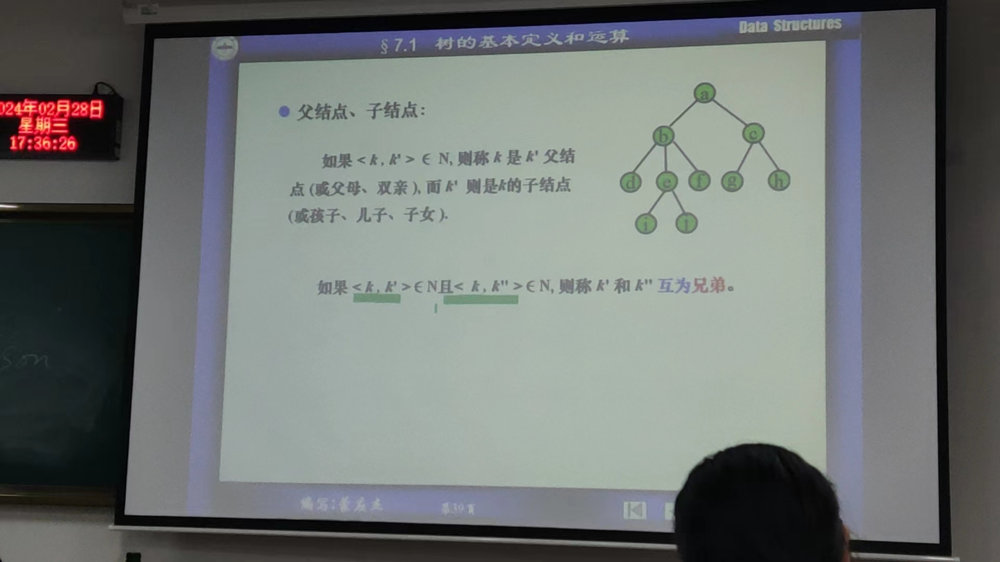

# 第七章 树形结构
## 7.1 树的定义与运算
### 一. 树形结构概论  
1. 与线性结构差异  
线性结构前驱后继只有一个；树形结构有多个后继  
2. 地位  
计算机中最重要的非线性结构  
（1）计算机中的信息组织  
（2）

  

  
### 二. 树的基本定义  
树T是满足如下性质的有限个节点组成的非空集合：  
（1）T中有且仅有一个称为根的   

另一种定义：  
  

定义中对于子树的个数和次序无约束————有序树（同一树形态不同）  
   

森林：没拍上  

图论与数据结构中树有差别  
  

  

  

  

  

### 三. 树形结构中常用术语  
结点的度：结点拥有子树的个数，出度  
终端节点：度为零的结点，叶节点，叶子  
非终端节点：度非零的结点，内节点  
树的度：树中结点度的最大值 

没拍上  
父节点，子节点：  
如果$<k, k'> \in$ N, 则称k是k'的父节点，k'是k的子节点（儿子，子女）  

  

树的高度  

边
    

### 四。树形结构表示方法
1. 
2. 
3. 嵌套括弧表示法  

4. 凹入表示法  
  

5. ??

### 五。树形结构中的运算 
  

### 六。树的存储方法
  

1. 双亲表示法
  
  
   

2. 孩子表示法
  
  
  

3. 孩子兄弟表示法
  
  

## 7.2 二叉树
## 7.3 遍历二叉树