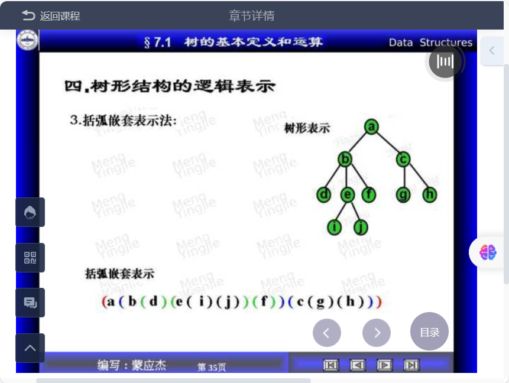
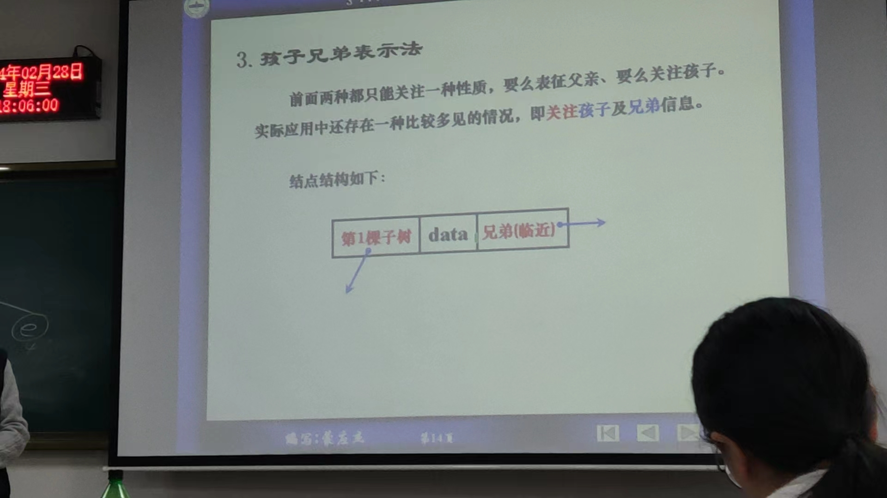

# 第七章 树形结构
## 7.1 树的定义与运算
### 一. 树形结构概论  
1. 与线性结构差异  
线性结构前驱后继只有一个；树形结构有多个后继  
2. 地位  
计算机中最重要的非线性结构  
（1）计算机中的信息组织  
（2）

  

  
### 二. 树的基本定义  
树T是满足如下性质的有限个节点组成的非空集合：  
（1）T中有且仅有一个称为根的结点   
（2）除节点之外，其余结点分成m（m>0）个不相交的集合$T_1, T_2 ---- T_m$，均为T的子树    

另一种定义：  
  

定义中对于子树的个数和次序无约束————有序树（同一树形态不同）  

   

森林：将零棵或多颗不相交的树的集合称为森林，约定俗成森林中的树均为有序树  

图论与数据结构中树有差别  
  

  

  

  

  

### 三. 树形结构中常用术语  
结点的度：结点拥有子树的个数，出度  
终端节点：度为零的结点，叶节点，叶子  
非终端节点：度非零的结点，内节点  
树的度：树中结点度的最大值 
  
父节点，子节点：  
如果$<k, k'> \in$ N, 则称k是k'的父节点，k'是k的子节点（儿子，子女）  

  

树的高度  

边
    

### 四。树形结构表示方法
1. 自然数的形态表示  
2. 文氏图表示  
3. 嵌套括弧表示法  
4. 凹入表示法  

  
  
  
  

### 五。树形结构中的运算 
  

### 六。树的存储方法
  

1. 双亲表示法
  
  
   

2. 孩子表示法
  
  
  

3. 孩子兄弟表示法
  
  

## 7.2 二叉树
二叉树是满足如下性质的节点有限集合：    
T是空集；或T包含一个根节点且其余节点分成两个不相交的集合，并分别被称为根结点的左子树和右子树。  
### 二叉树与树的异同  
（1）定义之间的比较  
  
（2）本质  
  

最主要区别：二叉树子树的个数确定性以及次序有序性（即使只有一颗子树也要确定左右）  
结论：二叉树不是树/有序树的特例，本质上是两种不同的研究对象  
### 二叉树的基本形态  
由于二叉树的定义是递归的，故二叉树定义基本项为空   

  

### 二叉树的主要特征
------
$性质1：在一个二叉树中，第i(i>=1)层的结点数最多为2^{i-1}$   
  

  

    
满二叉树：
完全二叉树最后一层可以不满  
非完全二叉树：节点编号不一一对应   

二叉树的第三个性质：  
  

第4个：  
  

第五个性质：  
  

### 二叉树的存储表示  
------  
\
顺序存储：  
  
   
能够充分利用性质5，但空间浪费大  
还有压缩存储（看课件）  
\
链接存储（二叉树的主要存储方式）：  
  

  

  

三重链表表示：  
  
  
## 7.3 遍历二叉树  
--
遍历：对于给定的数据结构，系统的访问该结构中的每个节点，且每个节点仅被访问一次的操作称为遍历（周游，游历）  

遍历二叉树：对于给定的二叉树，系统的访问该二叉树中的每个节点，且每个节点仅被访问一次的操作称为遍历二叉树  

### 二叉树的遍历次序
1. 基于层次策略
  
2. 基于深度策略  
  

### 先根遍历
  

### 中根遍历
  

  

    

  

#### 中根逆转遍历
价值不高

### 后根遍历

  

  

  

  

## 树、二叉树的转化

  

  

二叉树还原为树：  

森林转化为二叉树：
1. 树转化为二叉树
2. 依次连接二叉树

二叉树还原为森林：
1. 抹线
2. 二叉树还原为森林

  

***树的遍历***

  

  

***森林的遍历***

  

## 线索树
  

## 树形结构的应用

###

###

###
#### 霍夫曼算法及霍夫曼树
