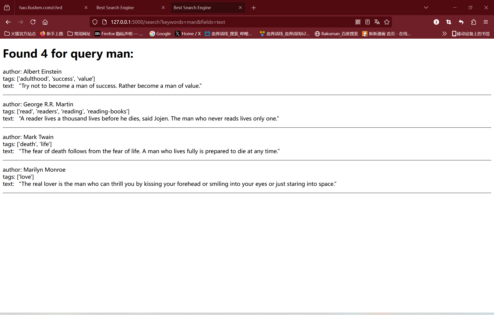
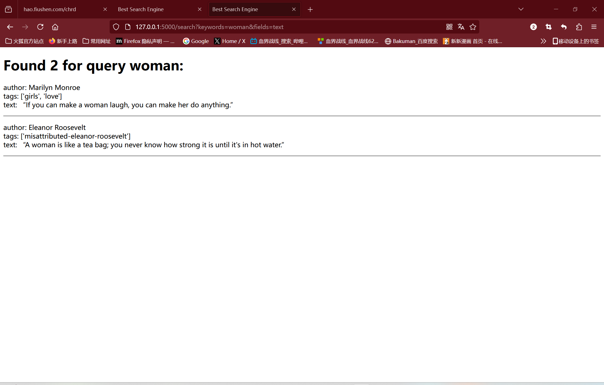

# Scrapy & ElasticSearch & Flask
Please implement a crawler and search engine

1. Crawl a website, such as LZU, or Douban.com. You should crawl at least 50 items.
Introduction for your crawler:
```
My crawler will grab book information from Douban.com, including title, author and rating. We will grab at least 50 pieces of data for subsequent analysis and storage
```


Your code of spider:
```python
import scrapy
import logging

class QuotesSpider(scrapy.Spider):
    name = "quotes"

    custom_settings = {
        'FEED_URI': 'quotes_output.json',
        'FEED_FORMAT': 'json',
    }

    def start_requests(self):
        urls = [f"http://quotes.toscrape.com/page/{i}/" for i in range(3)] 
        for url in urls:
            yield scrapy.Request(url=url, callback=self.parse)

    def parse(self, response):
        logging.info(f"Response URL: {response.url}")
        logging.info(f"Response status: {response.status}")

        logging.info(f"Response body (first 500 characters): {response.text[:500]}")

        for quote in response.css('div.quote'):
            item = {
                'text': quote.css('span.text::text').get(),
                'author': quote.css('span small.author::text').get(),
                'tags': quote.css('div.tags a.tag::text').getall(),  
            }
            yield item  


        next_page = response.css('li.next a::attr(href)').get()  
        if next_page:  
            yield response.follow(next_page, self.parse)
```

2. Write your code (don't use scrapyelastic plugin) to save the data crawed by scrapy into ElasticSearch.

Your code of Python:
```PYTHON
class ElasticSearchBatchImporter:
    def __init__(self):
        self.es_url = "http://172.16.249.198:9200/zhangqirui_author_scrapy/_doc/"
        self.auth = ('320220941080@lzu.edu.cn', '123456')  

    def import_data(self, json_file):
        with open(json_file, 'r', encoding='utf-8') as f:
            data = json.load(f)  

            for item in data:
                response = requests.post(self.es_url, auth=self.auth,
                                         headers={"Content-Type": "application/json"}, json=item)

                if response.status_code not in [200, 201]:
                    print(f"Failed to insert item: {item}. Error: {response.text}")
                else:
                    print(f"Successfully inserted item: {item}")
```

3. Please show your data in ElasticSearch by the following command:
```json
GET /zhangqirui_author_scrapy/_search  
{  
  "query": {  
    "match_all": {}  
  }  
}
```

Your response:
```json
{
  "took": 1,
  "timed_out": false,
  "_shards": {
    "total": 1,
    "successful": 1,
    "skipped": 0,
    "failed": 0
  },
  "hits": {
    "total": {
      "value": 100,
      "relation": "eq"
    },
    "max_score": 1,
    "hits": [
      {
        "_index": "zhangqirui_author_scrapy",
        "_id": "Cj3DwJMBzrtgRTHViK4t",
        "_score": 1,
        "_source": {
          "text": "“The world as we have created it is a process of our thinking. It cannot be changed without changing our thinking.”",
          "author": "Albert Einstein",
          "tags": [
            "change",
            "deep-thoughts",
            "thinking",
            "world"
          ]
        }
      },
      {
        "_index": "zhangqirui_author_scrapy",
        "_id": "Cz3DwJMBzrtgRTHViK78",
        "_score": 1,
        "_source": {
          "text": "“It is our choices, Harry, that show what we truly are, far more than our abilities.”",
          "author": "J.K. Rowling",
          "tags": [
            "abilities",
            "choices"
          ]
        }
      },
      {
        "_index": "zhangqirui_author_scrapy",
        "_id": "DD3DwJMBzrtgRTHVia4x",
        "_score": 1,
        "_source": {
          "text": "“There are only two ways to live your life. One is as though nothing is a miracle. The other is as though everything is a miracle.”",
          "author": "Albert Einstein",
          "tags": [
            "inspirational",
            "life",
            "live",
            "miracle",
            "miracles"
          ]
        }
      },
      {
        "_index": "zhangqirui_author_scrapy",
        "_id": "DT3DwJMBzrtgRTHVia5g",
        "_score": 1,
        "_source": {
          "text": "“The person, be it gentleman or lady, who has not pleasure in a good novel, must be intolerably stupid.”",
          "author": "Jane Austen",
          "tags": [
            "aliteracy",
            "books",
            "classic",
            "humor"
          ]
        }
      },
      {
        "_index": "zhangqirui_author_scrapy",
        "_id": "Dj3DwJMBzrtgRTHVia54",
        "_score": 1,
        "_source": {
          "text": "“Imperfection is beauty, madness is genius and it's better to be absolutely ridiculous than absolutely boring.”",
          "author": "Marilyn Monroe",
          "tags": [
            "be-yourself",
            "inspirational"
          ]
        }
      },
      {
        "_index": "zhangqirui_author_scrapy",
        "_id": "Dz3DwJMBzrtgRTHVia62",
        "_score": 1,
        "_source": {
          "text": "“Try not to become a man of success. Rather become a man of value.”",
          "author": "Albert Einstein",
          "tags": [
            "adulthood",
            "success",
            "value"
          ]
        }
      },
      {
        "_index": "zhangqirui_author_scrapy",
        "_id": "ED3DwJMBzrtgRTHVia7j",
        "_score": 1,
        "_source": {
          "text": "“It is better to be hated for what you are than to be loved for what you are not.”",
          "author": "André Gide",
          "tags": [
            "life",
            "love"
          ]
        }
      },
      {
        "_index": "zhangqirui_author_scrapy",
        "_id": "ET3DwJMBzrtgRTHViq42",
        "_score": 1,
        "_source": {
          "text": "“I have not failed. I've just found 10,000 ways that won't work.”",
          "author": "Thomas A. Edison",
          "tags": [
            "edison",
            "failure",
            "inspirational",
            "paraphrased"
          ]
        }
      },
      {
        "_index": "zhangqirui_author_scrapy",
        "_id": "Ej3DwJMBzrtgRTHViq5k",
        "_score": 1,
        "_source": {
          "text": "“A woman is like a tea bag; you never know how strong it is until it's in hot water.”",
          "author": "Eleanor Roosevelt",
          "tags": [
            "misattributed-eleanor-roosevelt"
          ]
        }
      },
      {
        "_index": "zhangqirui_author_scrapy",
        "_id": "Ez3DwJMBzrtgRTHViq6B",
        "_score": 1,
        "_source": {
          "text": "“A day without sunshine is like, you know, night.”",
          "author": "Steve Martin",
          "tags": [
            "humor",
            "obvious",
            "simile"
          ]
        }
      }
    ]
  }
}
```

4. Please create a website using Flask to display your crawled data from ElasticSearch. Users should be able to enter their search words in specific fields (such as author or title). The website will then return the retrieved results in a visually appealing manner (you can use CSS and images to decorate your webpage).

Introduction for your search engine:
```
This search engine is a simple Flask application that allows users to search for books by title or author. The data is retrieved from Elasticsearch and displayed in a visually appealing manner with CSS styling.
```

Your code:
```python
from flask import Flask, url_for
from flask import request
from flask import render_template
import ssl
import base64
from elasticsearch import Elasticsearch
# from elasticsearch.connection import create_ssl_context

# Create the web app with a `static` directory for static files
app = Flask(__name__, static_url_path='/static')

# home page
# the `/` is the root of your web app
@app.route('/')
def home():
    return render_template('home.html')


# app = Flask(__name__, static_url_path='/static')

# Add the following
# context = create_ssl_context()
# context.check_hostname = False
# context.verify_mode = ssl.CERT_NONE

es = Elasticsearch(
    ['http://172.16.249.198:9200'],
    http_auth=('320220941080@lzu.edu.cn', '123456')
)


# search result page
@app.route('/search', methods=['get'])
def search():
    keywords = request.args.get('keywords')
    fields = request.args.get('fields')
    # Include the keywords in a query object (JSON)
    query = {
    "multi_match":{
      "query": keywords,
      "fields": fields
    }
}

    # Send a search request with the query to server
    res = es.search(index="zhangqirui_author_scrapy", query=query, from_=0, size=20)
    hits = res["hits"]["total"]["value"]
    return render_template('index.html', keywords=keywords, fields=fields, hits=hits, docs=res["hits"]["hits"])
```

Add some snapshots of your search results.
   
   
   
   


Please write a project report in PDF and submit our PDF in Blackboard. Your report should include above information. 