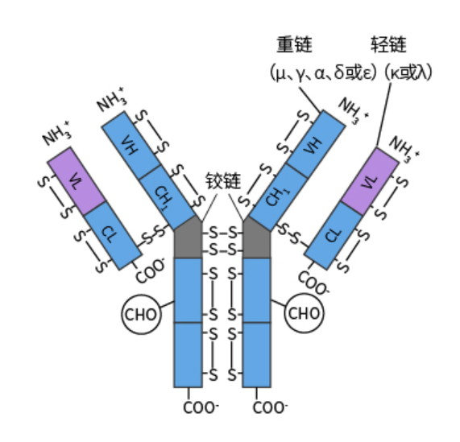
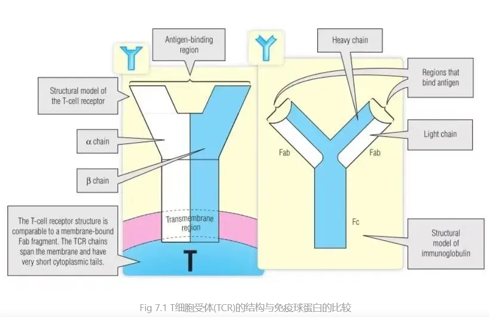
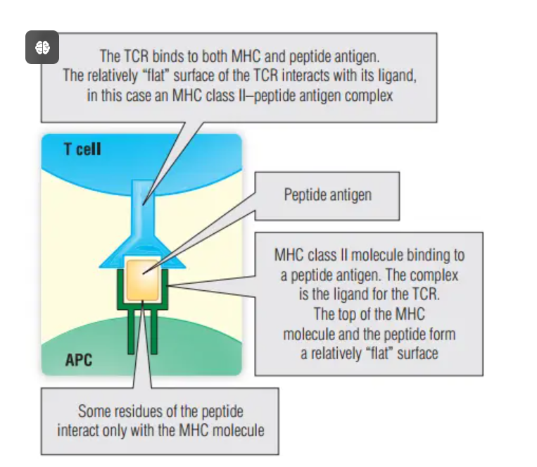
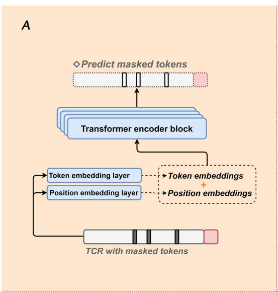
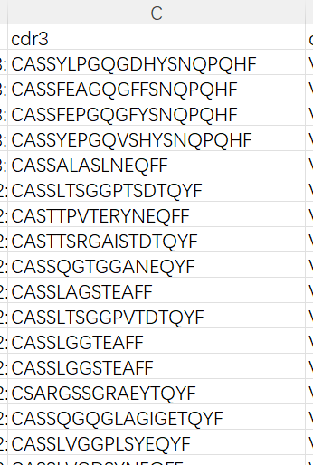
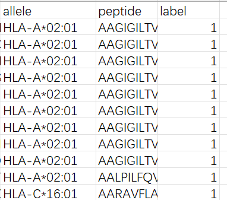
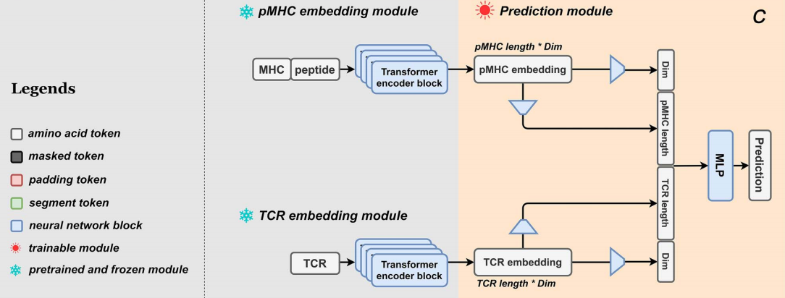

## 补充
antibody：一种免疫球蛋白lg, 可分为lgM, lgG, lgA, lgD, lgE，所有抗体具有相同结构, 两条重链，两条轻链。  
轻链可分为$\lambda, \kappa$, 重链可分为$\alpha, \beta, \mu, \gamma, \epsilon$
  
.png)
如图，上面是N端(铵根离子)，下面是C端(羧酸根)，长的是重链，左右两侧短的是轻链。  

抗体(免疫球蛋白)各个区域：V(可变区)， C(恒定区)，D区和J区。     
v可变区：由$\frac{1}{4}重链+\frac{1}{2}轻链组成，即VL,VH$一个抗体有两个V区，存在两个抗原结合位点，可结合两个antigen. 该区域中某特定位置的氨基酸残基组成和排列顺序高度可变的部位为超变区(HVR)或抗原互补决定区(CDR), 有CDR1, CDR2, CDR3    

恒定区C：占轻链$\frac{1}{2}, 重链\frac{3}{4}/\frac{4}{5}$  

MHC:主要组织相容性复合体(major histocompatibility complex)  
antigen/表位/piptide: 和MHC相连的肽链, 与TCR结合部位  
TCR:T细胞受体，异二聚体膜蛋白  
TCR特异性：体现在可变区$\alpha, \beta, CDR3$  
V(D)J:细胞产生多种抗体和TCR受体的DNA重排反应。  

TCR与antibody：都与抗原结合，结构相似。  
  
两种TCR:$\alpha, \beta型和\gamma, \delta型，第一种占95\%，主要TCR都是\alpha、\beta型$  
TCR同样具有V区，C区，J区和D区，V区中存在高变区，而C区基因较少.     
TCR和抗体的编码基因片段很相似  
$组成TCR的\alpha链基因(V, J)近似于抗体中轻链的\kappa和\lambda基因, 而\beta(V, D, J)编码基因类似抗体重链的编码基因$

***TCR与抗原的结合***  
antigenic peptide：抗原肽  
抗原肽经过巨噬细胞处理后，借助MHC呈递在细胞表面，如图所示：  
  
抗原肽在MHC凹槽中与TCR结合。除此之外，还有少数超抗原独立于抗原加工和呈递  

## pMTnet  


## TABR-BERT  

模型的例子包括DLpTCR[11]，一个集成pTCRα和pTCRβ信息的集成模型; ERGO-II[12]利用多种输入来源，如表位、MHC亚型、T细胞类型、CDR3α和CDR3β链以及相应的V和J基因。ImRex[13]和TEIM[14]分别利用卷积神经网络(cnn)[15]获取TCR和表位序列的理化性质和接触信息。此外，PanPep[16]使用神经图灵机(ntm)来增强模型的鲁棒性，特别是在面对看不见的表位时。最后，pMTnet[17]采用迁移学习模型，利用预训练模型迁移TCR序列信息和pMHC绑定知识，提高TCR-pMHC预测性能。 

大多数方法，包括DLpTCR、ImRex、PanPep和TEIM，都不能有效利用大量未标记的TCR序列数据。此外，除ERGO-II和pMTnet外，这些模型不考虑MHC亚型信息。

此外，除了pMTnet之外，关键的pMHC结合信息在很大程度上被忽略了。pMTnet采用的嵌入方法倾向于记忆训练数据，导致对未知表位的预测泛化较差[16]。有效利用来自未标记TCR序列，表位序列，MHC亚型和pMHC结合信息  


pMHC-BERT: 一个TCR-抗原结合识别预测模型， 包含三个子模型。  
1. TCR嵌入模型
2. pMHC嵌入模型
3. 基于多层感知器的(MLP)TCR-pMHC结合识别预测模型  

###  TCR嵌入模型  
  
  

输入：TCR上的$\beta$链V区CDR3序列, 如图，长度不定  
  

分词器：将单词继续分割  

***提取特征：BERT模型***  

1. TCR序列
遍历cdr3数据集，用blosum矩阵表示氨基酸序列，将每个tcr序列用掩码22拓展到最大长度，随机选取1-5个氨基酸，覆盖掩码21/0-19某个数。 在Embedding层中，调整标记嵌入和位置嵌入的尺寸一致，然后相加。  
4层Encode层，每一层包含一个多头自注意力机制层和反向传播层。第一层自注意力机制层输入为embedding层的输出。  
```python
#这是自注意力机制层的输入
def forward(self, Q, K, V, attn_mask):

#自注意力机制层
class ScaledDotProductAttention(nn.Module):
    def __init__(self, d_model):
        super(ScaledDotProductAttention, self).__init__()
        self.d_model = d_model

    def forward(self, Q, K, V, attn_mask):
        scores = torch.matmul(Q, K.transpose(-1, -2)) / np.sqrt(self.d_model * 2) # scores : [batch_size, n_heads, seq_len, seq_len]
        scores.masked_fill_(attn_mask, -1e9) # Fills elements of self tensor with value where mask is one.
        attn = nn.Softmax(dim=-1)(scores)
        context = torch.matmul(attn, V)
        return context


#前向传播层  实际上就是两层线性层变化一下尺寸，经过激活函数再把尺寸变回来
class PoswiseFeedForwardNet(nn.Module):
    def __init__(self, d_model):
        super(PoswiseFeedForwardNet, self).__init__()
        self.fc1 = nn.Linear(d_model, d_model*4)
        self.fc2 = nn.Linear(d_model*4, d_model)

    def forward(self, x):
        # (batch_size, seq_len, d_model) -> (batch_size, seq_len, d_ff) -> (batch_size, seq_len, d_model)
        return self.fc2(gelu(self.fc1(x)))

#编码层
class EncoderLayer(nn.Module):
    def __init__(self, d_model, n_heads):
        super(EncoderLayer, self).__init__()
        self.enc_self_attn = MultiHeadAttention(d_model=d_model, n_heads=n_heads)#自注意力机制层
        self.pos_ffn = PoswiseFeedForwardNet(d_model=d_model)#前向传播层

    def forward(self, enc_inputs, enc_self_attn_mask):
        enc_outputs = self.enc_self_attn(enc_inputs, enc_inputs, enc_inputs, enc_self_attn_mask) # enc_inputs to same Q,K,V
        enc_outputs = self.pos_ffn(enc_outputs) # enc_outputs: [batch_size, seq_len, d_model]
        return enc_outputs
```
即实际上自注意力机制层的输入为Query，Key和Value，但是这里直接把相同的Embedding层输出给了Query，Key和Value。自注意力机制层是求KEY和QUERY的点积，除以维度的开方。根据给定掩码位置masked_pos将对应的值改为-1e9使得掩码对应注意力分数接近于0，防止干扰。最后再将注意力分数乘以Value，得到加权后的向量。接下来经过前向传播层，再将输出传递给下一层编码层。  

经过4层编码层后，BERT模型输出掩码预测误差和经过多次加权和前向传播的cdr3序列嵌入。  

2. pMHC序列嵌入  
输入为MHC基因型, peptide(多肽)和label(正样本为1，负样本为0)。  
  
负样本是作者自己生成的，即随机选择一个MHC基因型，再随机选择一个多肽    
训练流程与TCR相同，在Embedding层中将MHC基因型，多肽链和label嵌入统一尺寸之后相加。之后和上述一样。

3. pMHC-BERT预测模型
  


## TCRconv


