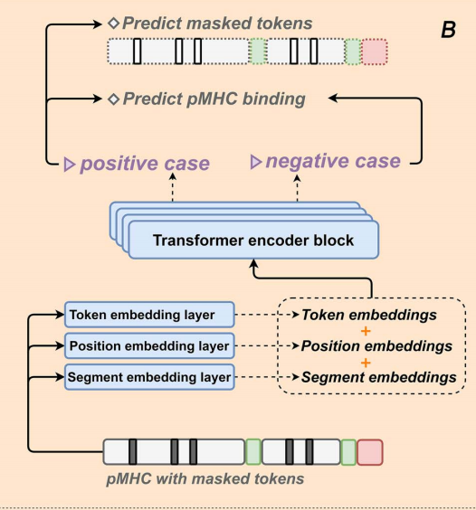
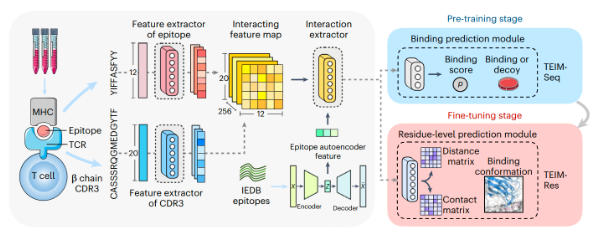

## 补充
antibody：一种免疫球蛋白lg, 可分为lgM, lgG, lgA, lgD, lgE，所有抗体具有相同结构, 两条重链，两条轻链。  
轻链可分为$\lambda, \kappa$, 重链可分为$\alpha, \beta, \mu, \gamma, \epsilon$
  
.png)
如图，上面是N端(铵根离子)，下面是C端(羧酸根)，长的是重链，左右两侧短的是轻链。  

抗体(免疫球蛋白)各个区域：V(可变区)， C(恒定区)，D区和J区。     
v可变区：由$\frac{1}{4}重链+\frac{1}{2}轻链组成，即VL,VH$一个抗体有两个V区，存在两个抗原结合位点，可结合两个antigen. 该区域中某特定位置的氨基酸残基组成和排列顺序高度可变的部位为超变区(HVR)或抗原互补决定区(CDR), 有CDR1, CDR2, CDR3    

恒定区C：占轻链$\frac{1}{2}, 重链\frac{3}{4}/\frac{4}{5}$  

MHC:主要组织相容性复合体(major histocompatibility complex)  
antigen/表位/piptide: 和MHC相连的肽链, 与TCR结合部位  
residue残基：多肽中的氨基酸，结合时脱水了，所以称为残基  
TCR:T细胞受体，异二聚体膜蛋白  
TCR特异性：体现在可变区$\alpha, \beta, CDR3$  
V(D)J:细胞产生多种抗体和TCR受体的DNA重排反应。  

TCR与antibody：都与抗原结合，结构相似。  
  
两种TCR:$\alpha, \beta型和\gamma, \delta型，第一种占95\%，主要TCR都是\alpha、\beta型$  
TCR同样具有V区(可变区)，C区(恒定区)，J区(连接区)和D区(多样区)，V区中存在高变区，而C区基因较少，且基本无变化.  TCR的基因重排是V,(D),J基因的交换。   
TCR和抗体的编码基因片段很相似  
$组成TCR的\alpha链基因(V, J)近似于抗体中轻链的\kappa和\lambda基因, 而\beta(V, D, J)$编码基因类似抗体重链的编码基因  
由于$\alpha和\beta$一个轻链一个重链，轻链中无D区，故当同时使用$\alpha\beta$序列时，只考虑V区J区

***TCR与抗原的结合***  
antigenic peptide：抗原肽  
抗原肽经过巨噬细胞处理后，借助MHC呈递在细胞表面，如图所示：  
  
抗原肽在MHC凹槽中与TCR结合。除此之外，还有少数超抗原独立于抗原加工和呈递  


## TABR-BERT 
 Accurate TCR-pMHC interaction prediction using a
BERT-based transfer learning method  

数据来源：IEDB、McPAS、VDJdb和PIRD


TABR-BERT: 一个TCR-抗原结合识别预测模型， 包含三个子模型。  
1. TCR嵌入模型
2. pMHC嵌入模型
3. 基于多层感知器的(MLP)TCR-pMHC结合识别预测模型  

###  TCR-BERT嵌入模型&pMHC-BERT嵌入模型  
  
  

输入：TCR上的$\beta$链V区CDR3序列, 如图，长度不定  
  

分词器：将单词继续分割  

***提取特征：BERT模型***  

1. TCR序列
遍历cdr3数据集，用blosum矩阵表示氨基酸序列，将每个tcr序列用掩码22拓展到最大长度，随机选取1-5个氨基酸，覆盖掩码21/0-19某个数。 在Embedding层中，调整标记嵌入和位置嵌入的尺寸一致，然后相加。  
4层Encode层，每一层包含一个多头自注意力机制层和反向传播层。第一层自注意力机制层输入为embedding层的输出。  
```python
#这是自注意力机制层的输入
def forward(self, Q, K, V, attn_mask):

#自注意力机制层
class ScaledDotProductAttention(nn.Module):
    def __init__(self, d_model):
        super(ScaledDotProductAttention, self).__init__()
        self.d_model = d_model

    def forward(self, Q, K, V, attn_mask):
        scores = torch.matmul(Q, K.transpose(-1, -2)) / np.sqrt(self.d_model * 2) # scores : [batch_size, n_heads, seq_len, seq_len]
        scores.masked_fill_(attn_mask, -1e9) # Fills elements of self tensor with value where mask is one.
        attn = nn.Softmax(dim=-1)(scores)
        context = torch.matmul(attn, V)
        return context


#前向传播层  实际上就是两层线性层变化一下尺寸，经过激活函数再把尺寸变回来
class PoswiseFeedForwardNet(nn.Module):
    def __init__(self, d_model):
        super(PoswiseFeedForwardNet, self).__init__()
        self.fc1 = nn.Linear(d_model, d_model*4)
        self.fc2 = nn.Linear(d_model*4, d_model)

    def forward(self, x):
        # (batch_size, seq_len, d_model) -> (batch_size, seq_len, d_ff) -> (batch_size, seq_len, d_model)
        return self.fc2(gelu(self.fc1(x)))

#编码层
class EncoderLayer(nn.Module):
    def __init__(self, d_model, n_heads):
        super(EncoderLayer, self).__init__()
        self.enc_self_attn = MultiHeadAttention(d_model=d_model, n_heads=n_heads)#自注意力机制层
        self.pos_ffn = PoswiseFeedForwardNet(d_model=d_model)#前向传播层

    def forward(self, enc_inputs, enc_self_attn_mask):
        enc_outputs = self.enc_self_attn(enc_inputs, enc_inputs, enc_inputs, enc_self_attn_mask) # enc_inputs to same Q,K,V
        enc_outputs = self.pos_ffn(enc_outputs) # enc_outputs: [batch_size, seq_len, d_model]
        return enc_outputs
```
即实际上自注意力机制层的输入为Query，Key和Value，但是这里直接把相同的Embedding层输出给了Query，Key和Value。自注意力机制层是求KEY和QUERY的点积，除以维度的开方。根据给定掩码位置masked_pos将对应的值改为-1e9使得掩码对应注意力分数接近于0，防止干扰。最后再将注意力分数乘以Value，得到加权后的向量。接下来经过前向传播层，再将输出传递给下一层编码层。  

经过4层编码层后，BERT模型输出掩码预测误差和经过多次加权和前向传播的cdr3序列嵌入。  

采用Adam优化器，训练的参数为每个氨基酸的嵌入维度d_model, encoding层数n_layer, 注意头数目，词表长度和cdr3最大长度。     
损失函数为掩码位置的氨基酸预测值和实际值之间的一维交叉熵适应损失函数。  

2. pMHC序列嵌入  
输入为MHC序列, peptide(多肽)和segment(分段， 即要把MHC序列分成几段进行嵌入)。  
  
负样本是作者自己生成的，即随机选择一个MHC基因型，再随机选择一个多肽，最后给0的label负样本标签      
训练流程与TCR相同，在Embedding层中将MHC基因型，多肽链和分段嵌入统一尺寸之后相加。之后和上述一样。  

Adam优化器，训练的参数为每个氨基酸的嵌入维度d_model, encoding层数n_layer, 注意头数目，词表长度，分段数n_segment和cdr3最大长度。
两个损失函数，一个用于掩码位预测误差，同样使用一维交叉损失熵函数，另一个是正负样本label预测的mse损失函数。

3. pMHC-BERT预测模型  

  

将MHC序列，1个TCR序列和多个TCR对照组序列输入到前两步训练好的嵌入模型中，得到TCR和MHC嵌入。 分别将TCR和MHC序列输入2层映射层，即各自输入两层线性层，之后相加，再经过多层线性层和激活函数，得到各个对应位置的得分排名，找出预测的正样本TCR-MHC序列的排名，即正确样本对得分排名，来检测模型。最终模型输出应该是输出各个样本对的得分排名，得分最高的样本对为预测结果。  

训练时使用对比学习方法，对比学习损失函数：  
  

优化器为AdamW，优化参数pmhc_maxlen， tcr_maxlen， tcr_d_model和 pmhc_d_model（这四个参数和前面嵌入模型训练的参数不一样）   

4. 测试  

根据4个数据集构建4个不同的测试集，并进行零样本或非零样本学习测试，结果显示TABR-BERT的泛化能力和准确度都很高      
  

  
TABR-BERT在所有baseline test中都优于最先进的模型。图A显示了Te-S4的DLpTCR、ERGO-II、ImRex、PanPep、pMTnet、TEIM和TABR-BERT的受试者工作特征(ROC)曲线。“X”表示最优截止点，TABR-BERT的约登指数预测等级得分为0.901。图B显示了这些模型对Te-S4的精确召回率(PR)曲线。图C显示了Te-S1、Te-S2和Te-S3的TABR-BERT、pMTnet、PanPep、DLpTCR和ERGO-II的AUC-ROC值。图D显示了Te-S1、Te-S2和Te-S3这些模型的AUC-PR值。模型在面板上的颜色编码一致，AUC代表曲线下的面积。

TCR-bert的嵌入模型通过自注意机制，强调了TCR序列中对TCR-pmhc识别至关重要的关键残基。证明了残基的注意得分与其功能基序之间存在显著关联。使用GLIPH2算法确定了基序。特别是，与GLIPH2置信度得分最高的前15个基序簇中TCRβ序列的基序外基序相比，基序内的残基表现出更高的注意力得分。  
  

这一趋势在所有基序簇的TCRβ序列中一致存在(图4B)，具有统计学意义(图4C, p值< 0.001)。结果强调通过TCR-BERT嵌入模型成功捕获潜在的功能重要残基，从而支持下游迁移学习的有效性。

所以，BERT模型可以用于找出在TCR-epitope结合中关键的残基。  

### 优点  
1. 考虑到了除了表位序列之外的MHC亚型信息  
2. 使用对比训练方法，正样本和负样本同时输入权重一样的两个相同的模型  
3. 使用BERT学习了TCR序列，表位序列和MHC序列的特征，在zero shot test中表现出较强的准确度和泛化能力  

与pMTnet相比，模型显示出优越的预测能力，特别是在处理以前未见过的表位时。与pMTnet中使用的自编码器和LSTM方法相比，这一结果展现了基于bert的嵌入模型在从TCR和pMHC数据中捕获关键信息方面的效率。  

  

由于输出为得分排名，意味着该模型的TCR序列和MHC序列输入需要为一对多形式。  
在这里兼顾了检验准确度的需求，即在输入的测试集中，放入一个正样本，剩下的全都是负样本  
```python
def get_rank(test_tcr, test_pmhc, TCR_neg_df_1k, test_label=False):
    preds = []
    ranks = []
    for each_data_index in range(test_tcr.shape[0]):
        tcr_pos=test_tcr[each_data_index].unsqueeze(dim=0)
        pmhc=test_pmhc[each_data_index].unsqueeze(dim=0)
        #used the positive pair with 1k negative tcr to form a 1001 data frame for prediction                                                                      

        TCR_input_df=torch.cat([tcr_pos,TCR_neg_df_1k],dim=0)
        MHC_antigen_input_df= torch.repeat_interleave(pmhc, 1001, dim=0)
        
        prediction = model(torch.cat([TCR_input_df,MHC_antigen_input_df], dim=1))
        preds.append(prediction.tolist()[0])
        rank=1-(sorted(prediction.tolist()).index(prediction.tolist()[0])+1)/1001  #找到当前正例（即第一个预测结果，
        # 通常是正样本的预测分数）在排序后的列表中的位置（索引）。
        ranks.append(rank)
    preds = torch.tensor(preds, dtype=torch.float32)
    ranks = [1-i for i in ranks]
    if test_label:
        precision, recall, _thresholds = precision_recall_curve(test_label, ranks)
        PR = auc(recall, precision)
        AUC = roc_auc_score(test_label,ranks)
        return ranks, PR, AUC
    else:
        return ranks
```  

另外，检验中TEIM模型表现的也比较好  


## TCRconv  
数据：根据置信度评分采用VDJdb中$TCR\alpha\beta$链序列数据，有vdjdb-large和vdjdb-small两个数据集。数据集中有V区和J区  

模型输入为$TCR\alpha\beta$链序列，具体来说是Va/b氨基酸序列-CDR3-Ja/b氨基酸序列。最终输出为TCR序列属于各个表位类的概率。  
该模型实际上是一个多标签分类器，最后的输出是一串0-1之间的序列$\widehat{y_n}=\{y_{n1}, y_{n2}, ...y_{nC}\}$，分别对应不同表位的概率  

多标签实际上是类标签，用0/1表示该TCR序列能否结合该表位，标签并未输入到嵌入模块protBERT当中，只用于训练。  

  

模型嵌入采用的是protBERT模型，transformer的BERT模型输出的是输出是一个三维的张量，格式如下：
(batch_size, sequence_length, hidden_size)  

其中，batch_size 为当前批次的序列数量，sequence_length 为每个TCR序列的长度，hidden_size 是 BERT 模型中隐藏层的大小，也是氨基酸特征数量n_feat。   
本文在保存tcr嵌入时，交换了第2,3个维度，即各个TCR序列嵌入按照n-feat个特征重新组织，而并非是按照原本按照氨基酸组织的方式，与TCRconv中tcr和pmhc嵌入的组织方式相同。  

在构造分类模型的过程中，有线性单元和卷积单元。  
卷积单元如图所示，4个核大小不同的并行卷积层，结果相加之后，进行归一化，用激活函数激活和丢弃的操作，进入最后一个卷积层，再进行池化操作。  
线性单元就是先对TCR嵌入特征值进行最大池化操作，进行线性变换之后再通过激活函数激活。    
将LNN和CNN特征值合并，丢弃部分维度后，经过线性变换和激活函数，得到属于各个表位类别的概率  

优化器SWA, 学习率逐渐衰减  
  
其中p为阳性样本的权重, $p=\frac{N}{m*C}$  
总体误差：  
  

对MHC的HLA型作用检验：虽然VDJdb中可用的tcr-表位-mhc复合物包含多种hla类型，但大多数数据仅限于HLA-A*02，几乎所有表位都由单一hla-基团呈现。本文检查了不同HLA基因之间的结果差异，以及在任何HLA类型限制的数据下训练的TCRconv模型与仅使用HLA-a\*02限制的数据之间的结果差异。  


### 优点
1. 本文考虑了除cdr3之外的其他TCR序列V,J区。  
2. 在和其他模型(TCRGP,DeepTCR、SETE、TCRdist和ERGO-II)进行对比时，考虑到了TCR的交叉反应性，即可能结合不同表位， 为每个表位训练了单独的二元分类器，而不是训练多标签分类器。也就是说，其他模型的TCR-epitope结合预测会受到TCR交叉反应的影响      
3. 该模型为多标签分类器，可同时预测TCR与多个epitope结合，而不受交叉反应性影响  
4. 此模型证明了使用cdr3之外的其他TCR序列能够提高预测结果的准确度。在VDJdbb-large上，当上下文大小从无上下文增加到完整上下文(即全长TCRb序列，或vdj-序列)时，预测AUROC评分从0.68逐渐提高到0.77  
AUROC, AP
    
值得注意的是，不需要整个TCR嵌入，但是使用具有完整上下文的CDR3嵌入可以提供类似或稍微更好的结果。
5. 同时使用$\alpha\beta$的预测准确度要比单独使用高，且没有哪一条TCR链是在识别所有表位时预测准确度高于另一条链的  
  


### 一些结论
这篇文章说明了通过TCR序列预测表位结合的困难性。第一个例子是显示离各个TCR最近的另一个序列对与其结合的表位和其他表位的特异性对比，结果显示序列相似的TCR却往往不结合同一个表位。另一个例子是展示能识别同种表位的TCR降维后的嵌入十分分散。  即想直接通过分析相似TCR序列来预测表位特异性是十分困难的  

证实了跨表位的预测准确性与能够识别这些表位的tcr的多样性呈负相关（图B）   

本模型和baseline都在置信度更高的数据上表现更好  


## TEIM-Res  
数据来源：STCRDab45，VDJdb47、McPAS-TCR49和ImmuneCODE50、51  

  

输入为cdr3和表位序列，cdr3和表位都根据氨基酸序列构建数字嵌入，同时又根据配对的氨基酸和blosum62矩阵构建配对矩阵       

TEIM的序列特征提取器由嵌入层和一个卷积模块组成，该模块由核尺寸为3的1D CNN层、批处理归一化层和隐藏维数为256的整流线性单元(ReLU)激活函数组成。  

interacting feature map是cdr3和pmhc的数字嵌入相乘得到的。  
```python
        elif self.inter_type == 'mul':
            inter_map = cdr3_feat_mat * epi_feat_mat
```

interaction extractor由两层二维CNN模块组成，每个模块包含一个cnn2d层、一个批处理归一化层和一个ReLU激活函数。  

TEIM-Seq是预训练过程中的副产物  

除了最后一个模块外，TEIM-Seq和TEIM-Res模型共享相似的架构。它们都有特征提取器来分别学习CDR3和抗原表位的序列特征，然后将它们扩展到不同的维度以形成交互特征图。接下来，主要由二维卷积神经网络（2D CNN）组成的交互提取器用于提取成对残基交互信息。此外，由自动编码器生成的表位特征向量被馈送到交互提取器中以获取全局表位信息。最后，TEIM-Seq使用结合预测模块聚合所有成对交互来预测结合得分（即结合概率），而TEIM-Res使用由2D CNN层组成的残基级预测模块来预测距离矩阵和接触矩阵。  

两个不同的预测模块：  
```python
        self.seqlevel_outlyer = nn.Sequential(
            nn.AdaptiveMaxPool2d(1),  #最大池化层
            nn.Flatten(),    #展平
            nn.Dropout(0.2), #dropout层
            nn.Linear(dim_seqlevel, 1),
            nn.Sigmoid()
        )

        ## res-level prediction
        self.reslevel_outlyer = nn.Conv2d(
            in_channels=dim_hidden,
            out_channels=2,
            kernel_size=2*layers_inter+1,
            padding=layers_inter
        )
```  

输出距离矩阵和接触矩阵，接触矩阵实际上就是只取数值小于5的距离矩阵   

由于我们的残基接触数据集仅包含355个唯一的表位，故构建了一个自动编码器来从大规模未标记的表位序列数据集中提取信息特征。epitope autoenconder由两个具有32个输出维数的1D CNN模块组成，然后是一个平坦层和一个具有32个输出维数的全连接层。  

```python
class AutoEncoder(nn.Module):
    def __init__(self, 
        dim_hid,
        len_seq,
    ):
        super().__init__()
        embedding = tokenizer.embedding_mat()
        vocab_size, dim_emb = embedding.shape
        self.embedding_module = nn.Embedding.from_pretrained(torch.FloatTensor(embedding), padding_idx=0, )
        self.encoder = nn.Sequential(
            nn.Conv1d(dim_emb, dim_hid, 3, padding=1),
            nn.BatchNorm1d(dim_hid),
            nn.ReLU(),
            nn.Conv1d(dim_hid, dim_hid, 3, padding=1),
            nn.BatchNorm1d(dim_hid),
            nn.ReLU(),
        )

        self.seq2vec = nn.Sequential(
            nn.Flatten(),   #展平
            nn.Linear(len_seq * dim_hid, dim_hid),
            nn.ReLU()
        )
        self.vec2seq = nn.Sequential(
            nn.Linear(dim_hid, len_seq * dim_hid),
            nn.ReLU(),
            View(dim_hid, len_seq)
        )
        self.decoder = nn.Sequential(
            nn.ConvTranspose1d(dim_hid, dim_hid, kernel_size=3, padding=1),
            nn.BatchNorm1d(dim_hid),
            nn.ReLU(),
            nn.ConvTranspose1d(dim_hid, dim_hid, kernel_size=3, padding=1),
            nn.BatchNorm1d(dim_hid),
            nn.ReLU(),
        )
        self.out_layer = nn.Linear(dim_hid, vocab_size)

    def forward(self, inputs, latent_only=False):
        # inputs = inputs.long()
        seq_emb = self.embedding_module(inputs)
        seq_enc = self.encoder(seq_emb.transpose(1, 2))
        vec = self.seq2vec(seq_enc)
        seq_repr = self.vec2seq(vec)
        seq_dec = self.decoder(seq_repr)
        out = self.out_layer(seq_dec.transpose(1, 2))
        if latent_only:
            return vec
        else:
            return out, seq_enc, vec

```  
训练流程包括两个阶段：首先在序列级结合数据上预训练TEIM-Seq，然后在残基粒度的结合数据上微调TEIM-Res。  

TEIM-Seq使用Adam optimizer55进行优化，学习率为0.0002。利用学习率为0.001的Adam优化器对TEIM-Res的距离预测和接触点预测损失进行了总结和优化。


TEIM-Res可以预测所有TCR与表位之间的结合构象，从而揭示TCR与表位的关键接触位点。

同样使用了zero shot test  
采用了交叉验证策略来评估模型在三种不同的数据分裂设置下的性能:新分裂、新cdr3分裂和新表位分裂，即cdr3 β-epitope对、CDR3βs和验证集中的表位分别不在训练集中。我们用每个样本的Pearson相关系数、每个样本的均方误差和每个样本的平均相对误差来评价两两残差距离预测结果，用每个样本的精确召回率曲线下面积(AUPR)和马修斯相关系数(MCC)来评价每个样本的接触点预测结果。  

TEIM-Seq：与pMTnet和tcrdist3进行了比较  
tcrdist3的预测分数：  
  

对比测试：baseline，TCRpMHC，GalaxyPepDock18，PepNN-Seq和PepNN-Struc22   
  
本文进一步比较了最初设计用于蛋白质-肽相互作用预测的方法，包括对接工具GalaxyPepDock18和基于深度学习的方法PepNN-Seq和PepNN-Struc22。GalaxyPepDock在任何指标上都不能击败TEIM-Res和平均基线(图1d和扩展数据图1)。在AUPR和MCC得分方面，PepNN-Seq和PepNN-Struc在接触部位预测方面的表现也比TEIM-Res和平均基线差(图1e)。这些蛋白-肽相互作用模型失败的原因可能是它们只粗略地识别了蛋白质   

微调的结果不如原来的好：  
  
我们通过比较我们的原始模型和两个修改的模型来分析预训练阶段的贡献:“微调最后”和“不预训练”。在三种方法中，TEIM-Res的表现最好，说明我们的训练管道是有效的。即使只微调输出模块的模型(最后微调)仍然比没有预训练的模型(没有预训练)取得了更好的性能，这表明预训练阶段对最终的残差水平预测有很大的贡献。  

突变体样品的距离/接触变化与亲和力变化ΔΔG高度相关  
  
一个研究充分的TCR表位样本的现有突变数据，HLA-A:0201(命名为A6-Tax)呈递的A6 TCR和Tax表位30。作者从之前的研究中收集了32个A6-Tax复合物的突变序列，然后应用tiem-res预测它们的结合构象。预测的突变体样品的距离/接触变化与先前研究报道的亲和力变化ΔΔG高度相关. TEIM-Res能够检测tcr -表位相互作用的微妙突变影响，并揭示相应的结合亲和力变化。  

作者检测了亲和度下降最大的一个突变体样本，命名为A6_L7A-Tax_ Y8A，该样本只有两个突变位点:CDR3β的L7A和表位39的Y8A。根据预测，突变后突变位点周围的残基对大多会向远处移动，接触分数也较低(图c)。发现这两个突变位点都导致了A6_L7A-Tax_Y8A样本的亲和力降低  

### 优点  
1. 分割数据集采用了基于聚类的交叉验证分割策略，基于相似性进行分割，相似性公式如下： 
   
SW为两个序列之间的Smith-Waterman比对得分。然后采用单链接聚类算法，使不同聚类的任意两个序列之间的最大相似度小于阈值。为序列级数据集选择了0.5的相似阈值，为残差级数据集选择了0.8的相似阈值。
2. TEIM-Seq在序列级绑定预测上也取得了不错的性能  
3. 在残基水平和序列水平上分别进行分析

### 不足
TEIM-Res对于与高MHC对接角(TCR与MHC18相互作用的角度)或长序列相关的样本(图2a,b)表现不好。具有高MHC对接角度的样本实际上是典型TCR-pMHC对接构象的异常值28。对于长序列，较差的性能可能是由于数据量不足造成的  
  

### 一些结论
基准测试结果说明，为蛋白-肽相互作用设计的模型并不适用于tcr -表位相互作用，因此需要开发像TEIM-Res这样的专门模型。  

随着序列长度的增加，接触位点的数量越来越分散  

突变体样品的距离/接触变化与亲和力变化ΔΔG高度相关  

