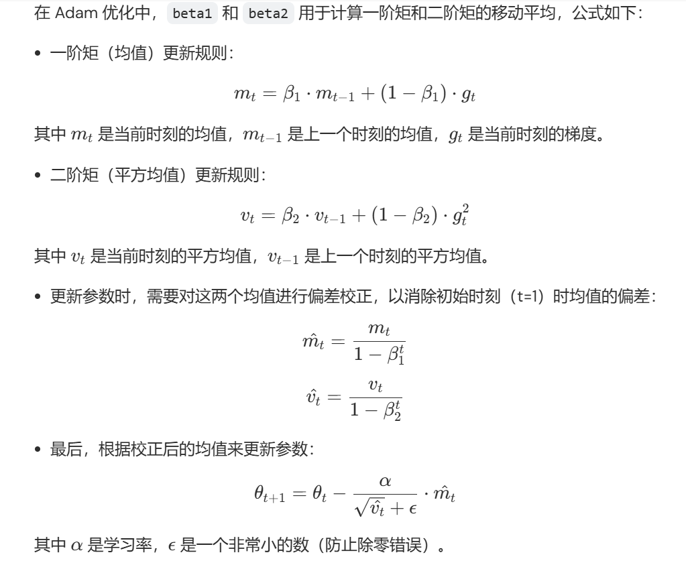
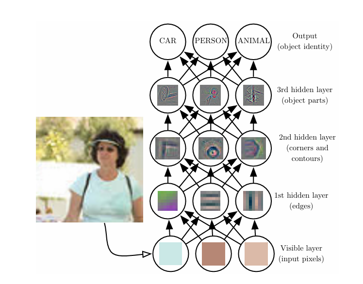
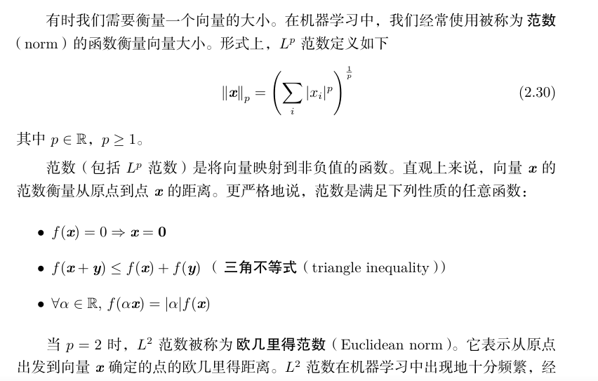
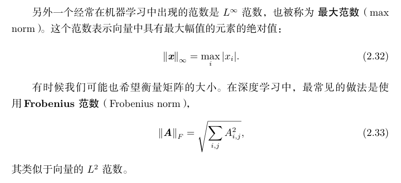
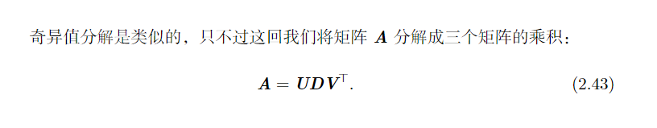

nn.Embeddings:一个查找词嵌入的模块，构造时需要使用训练好的字典/映射表  

  

# 机器学习  
## 概念
大体流程是提取合适的特征集，将特征提供给简单的机器学习算法。然而，对于某些复杂任务来说，特征集的提取是复杂困难的，为了解决这个问题，研究者们提出了表示学习，其提取出的特征往往比手动设计的特征表现得更好。    

表示学习的典型例子是自编码器。自编码器由一个编码器函数和一个解码器函数组成，编码器函数将输入数据转换为一种不同的表示，而解码器函数则将这个新的表示转换到原来的形式。   

当输入数据经过编码器和解码器之后尽可能多地保留信息，同时希望新的表示有各种好的特性，这也是自编码器的训练目标。

当设计特征或设计用于学习特征的算法时，我们的目标通常是分离出能解释观察数据的**变差因素**。在此背景下，因素这个词仅指代影响的不同来源；因素通常不是乘性组合。这些因素通常是不能被直接观察到的量。相反，它们可能是现实世界中观察不到的物体或者不可观测的力，但会影响可观测的量。    

在大部分人工智能应用中，理清变差因素，提取高层次、抽象的特征是非常困难的，**深度学习**则通过较为简单的表示来表达复杂表示，解决了表示学习中的核心问题。深度学习通过简单概念构建复杂概念

深度学习模型示意图：  
   
深度学习将所需的复杂映射分解为一系列嵌套的简单映射（每个由模型的不同层描述）来解决这一难题。输入展示在可见层，这样命名的原因是因为它包含我们能观察到的变量。然后是一系列从图像中提取越来越多抽象特征的隐藏层    

深度前馈网络或者多层感知机，也叫作前馈神经网络，是典型的深度学习模型。前馈神经网络的目标是近似某个函数$f^*$。    
这种模型被称为是前向的，是因为信息流过x，流经用于定义$f$的中间过程，最终到达输出$y$，模型输出和模型本身没有任何反馈链接。如果前馈神经网络包含反馈连接时，它们就会被称为**循环神经网络**   

前馈神经网络被称作网络，是因为它们通常用于许多不同函数复合在一起来表示。链式结构是神经网络中最常用的结构，链的全长被称作模型的**深度**，因此有了**深度学习**这个词。前馈神经网络的最后一层被称为输出层，在训练过程中，训练样本指明了输出层必须对于每个$x，都产生一个接近y的值$。但是训练样本无法管辖其它层产生什么数据，而是由学习算法指明，因此这些层被称为**隐藏层**   

这些网络被称为神经网络是因为他们或多或少收到过神经科学的启发。每个隐藏层的维度决定了网络的宽度

## 一些历史  
最早，深度学习的雏形出现在控制论。  
50你那带，感知机成为第一个根据每个类别的输入样本来学习权重的模型，同一个时期，自适应线性单元(ADALINE), 用于调节ADALINE权重的训练算法为随机梯度下降。   
目前大多数神经网络是基于一个称为整流线性单元的神经单元模型。  
长短时记忆网络：长序列建模   

## 数学相关  
范数  
  

  

单位向量是具有单位范数的向量：$||x||_2=1$    
$如果x^Ty=0, 则x与y相互正交$，如果其为单位向量，则是标准正交    

正交矩阵是指行向量和列向量分别是标准正交的方阵，$即A^TA=I$   

奇异值分解：每个矩阵不一定有特征向量，但一定能奇异值分解，可以分解为奇异值和奇异矩阵。  
  
$U,V都为正交矩阵，D为对角矩阵$    

# 如何调参

## 概念  
模型参数：由数据驱动调整  
超参数：不需要数据驱动，在训练前或训练中人为调整的参数    
例如，卷积核的具体核参数是模型参数，由数据驱动调整，而学习率是人为调整的超参数。需要注意，卷积核的数量和尺寸通常也被视作超参数   

### 超参数的分类  
- 网络参数：包括网络层之间的交互方式（相加，相乘或者串接），卷积核的数量和尺寸，网络层数（深度）和激活函数等   
- 优化参数：一般指学习率，批样本数量，不同优化器的参数及部分损失函数的可调参数   
- 正则化参数：如权重衰减系数，丢弃比率（dropout）等    

