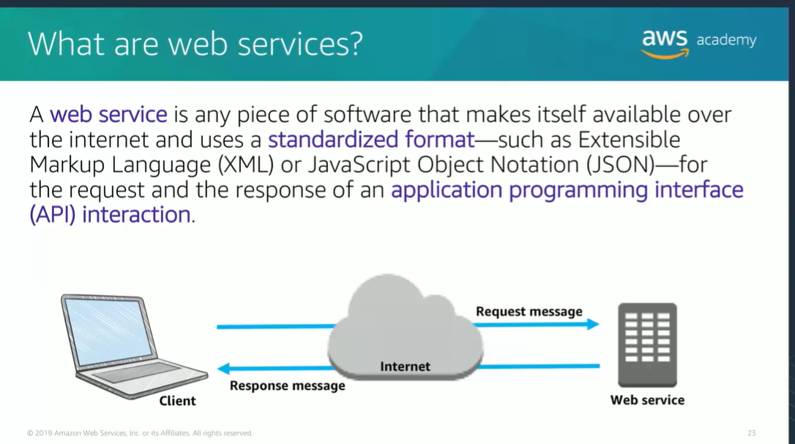
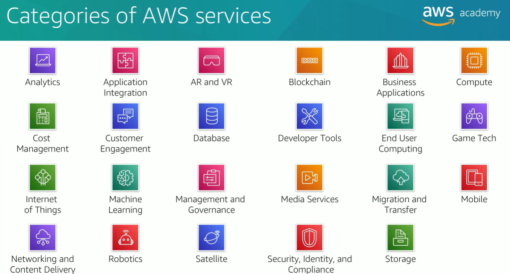
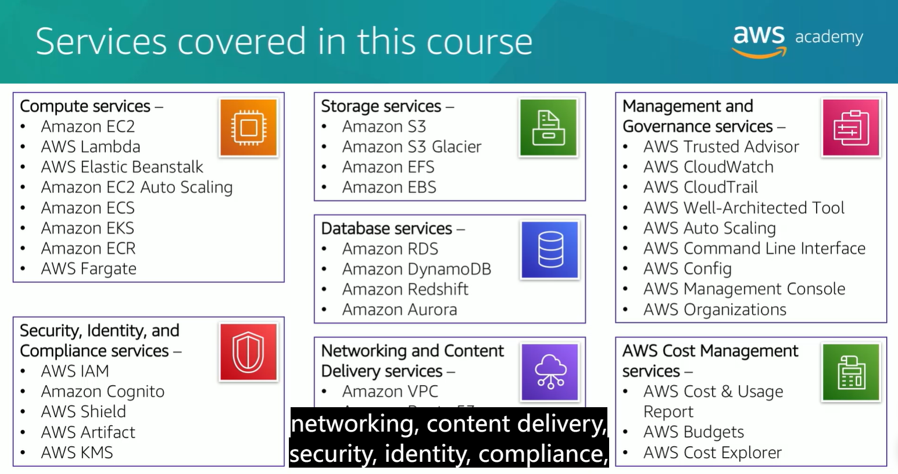
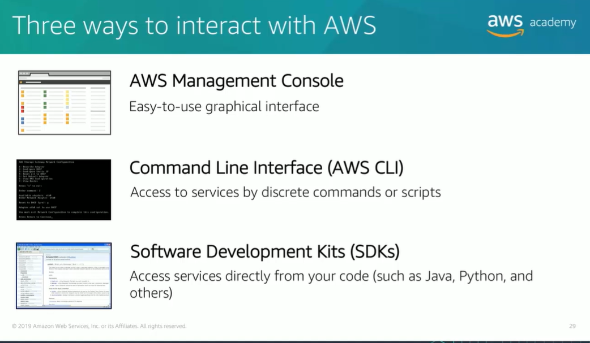

## Introduction to cloud computing
Cloud computing is the on-demand delivery of compute power, database, storage, applications and other IT resources via internet through pay-as-you-go pricing    

infrastructure as a service: more control over IT source  

platform as a service: related to hardware and operating system; help with deploying and application    

### 3 cloud computing deployment models (environment for deploying application)  
-----
Cloud computing deployment models:  Cloud Hybrid On-premises(private cloud)  

1. a cloud-based app is all-in-the-cloud implementation and running on the cloud  

2. a hybrid implementation is to connect your own infrastructure and application with cloud-based resource; located on the own hardware  

3. for on-premise (private cloud): deploying resources on premise useing virtualization and management tools 

for cloud models, all the infru

## advantages of cloud  
----
1. trade capital expense for variable expense(pay when consume)  
2. massive economies of scale  
3. stop guessing capacity  
4. increase speed and agility  
5. stop spending on running and maintaining
6. go global in minutes

## AWS
  
  
  
3 ways to interact with aws:  
  

\
\

AWS Region：物理区域  geographical area  
regions are connected between network infrastructure  

a region consists of several availability zones  
an availability region consists of several data centers
region中的资源需要人为复制到另一个region中  

regions provide redundancy and connectivity to the network  
