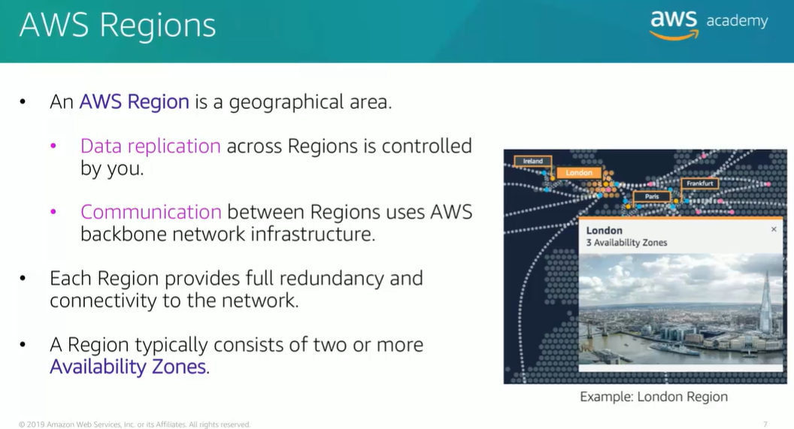
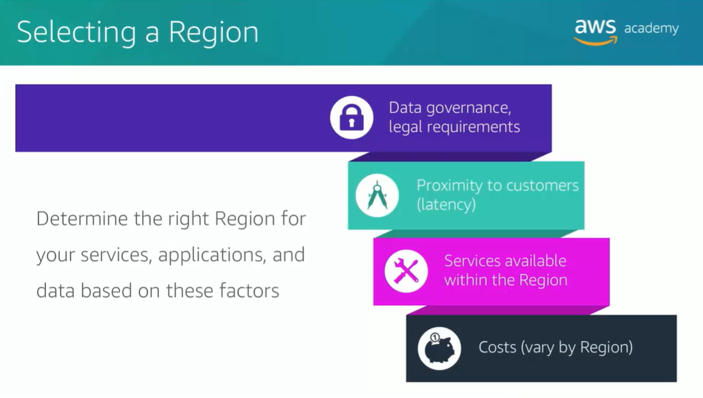
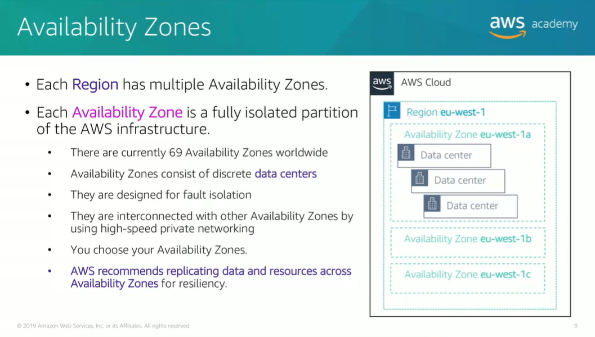

## AWS Global Infrastructure

AWS global infrastructure is designed and built to deliver a flexible, reliable, scable and secure ***cloud computing environment*** with high-equality glabal network performance.  

  

  

  

