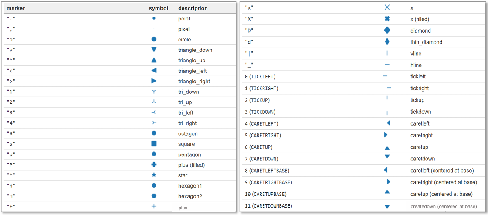
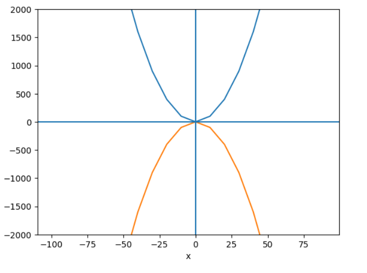
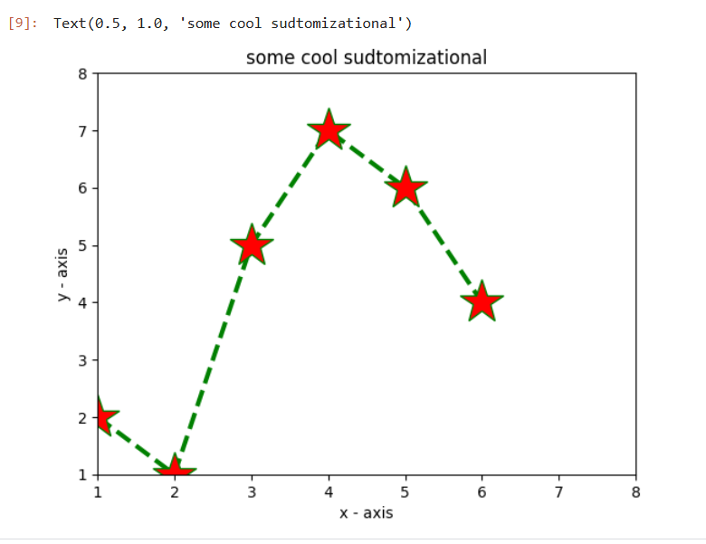
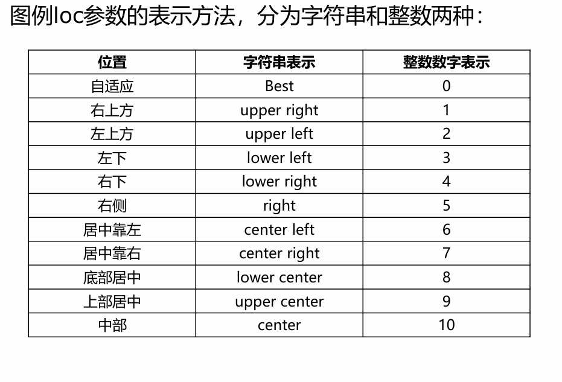
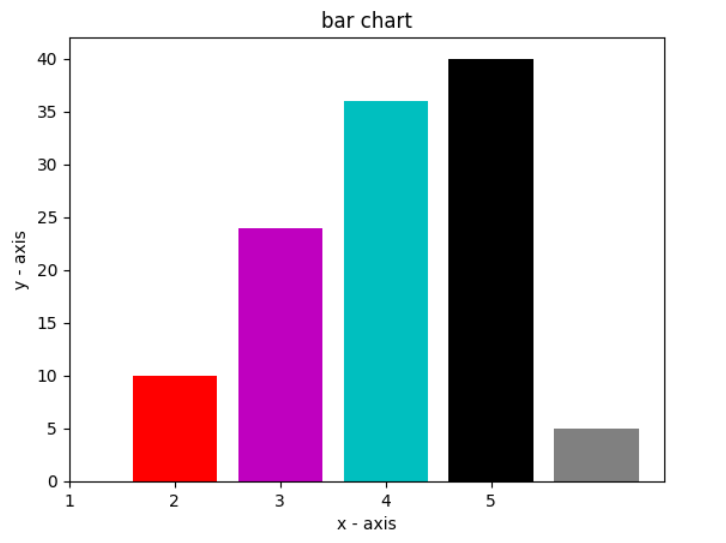
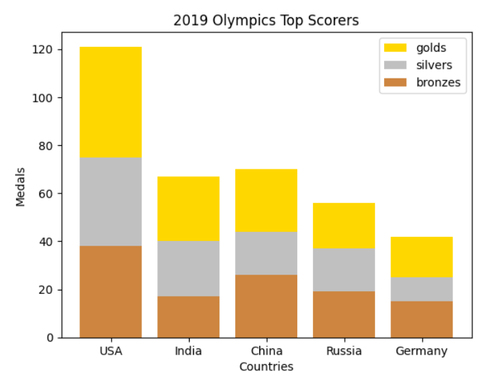
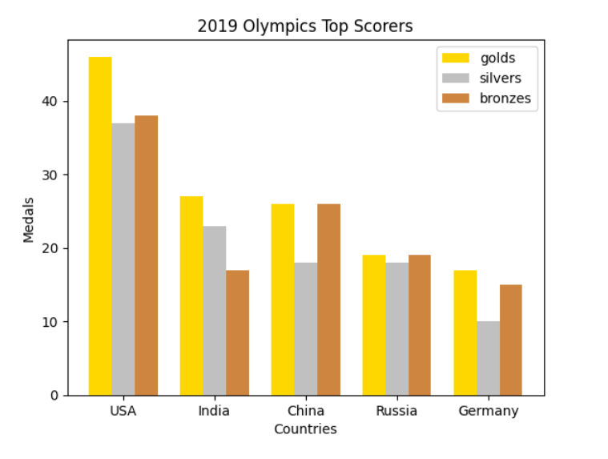
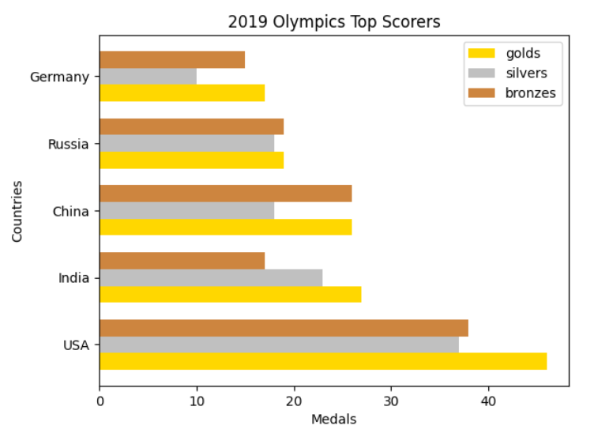
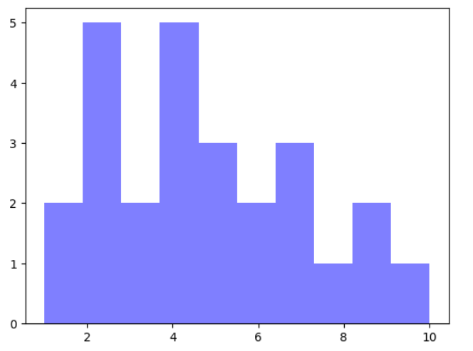
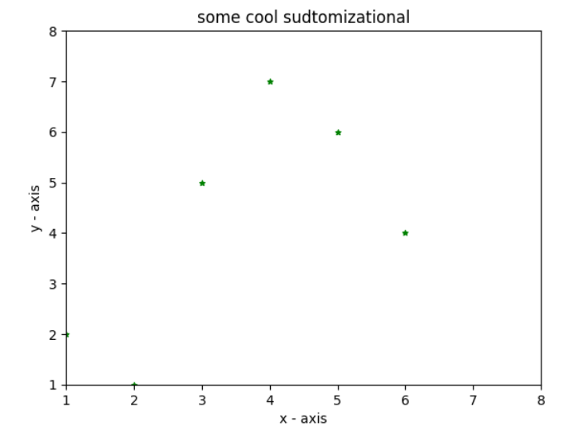

# Chapter 11-matplotlib和seaborn可视化 学习笔记  

## part I. matplotlib  
----  

### 折线图  

pyplot方法
• text()：在任意位置添加文本, 例如plt.text(3.5, 0.5, "$y=sin(x), x\in[0,2\pi)$")     
• xlabel()：将文本添加到x轴   
• ylabel()：将文本添加到y轴   
• title()：将标题添加到图中   
• savefig()：将图形保存到文件中   
• legend()：在图上显示图例   
• grid(): 网格线，plt.grid(color='r', linestyle='--', linewidth=1,alpha=0.3)    

颜色   
• ‘k’表示黑色  
• ‘b’表示蓝色  
• ‘c’表示青色  
• ‘g’表示绿色  
• ‘m’表示洋红  
• ‘r’表示红色  
• ‘y’黄色  
• ‘gray’或’grey’代表灰色  
• ‘lightgray’或’lightgrey’代表浅灰    

plot参数：  
• linestyle线型   
• linewidth宽度  
• marker点型   
• markerfacecolor点颜色  
• markersize点大小   

marker类型：  
  


```python
import matplotlib.pyplot as plt
y1 =[]
y2 =[]
x=range(-100,100,10)
for i in x:y1.append(i**2)
for i in x:y2.append(-i**2)

plt.plot(x, y1)
plt.plot(x, y2)
plt.xlabel("x")
plt.ylabel("y")
plt.ylim(-2000, 2000)
plt.axhline(0)  #中间竖线
plt.axvline(0)  #中间横线
plt.savefig("quad.png")
plt.show()

###############################################
x=[1,2,3,4,5,6] 
y=[2,1,5,7,6,4]

plt.plot(x, y, color='green', linestyle='--', linewidth=3, marker='*', markerfacecolor='red', markersize=15)
plt.ylim(1,8)
plt.xlim(1,8)
plt.xlabel("x - axis")
plt.ylabel("y - axis")
plt.title("some cool sudtomizational")  
############################################

```
  
  

### 柱状图  

legend loc参数：  
  

```python
import numpy as np

x=[1,2,3,4,5]
y=[10,24,36,40,5]

colors=['r','m','c','k','grey']

plt.bar(x, y, width=0.8, color=colors)
plt.xlabel("x - axis")
plt.xticks(np.arange(len(x)), x)
plt.ylabel("y - axis")
plt.title('bar chart')
plt.show()
####################################
countries = ['USA', 'India', 'China', 'Russia', 'Germany'] 
bronzes = np.array([38, 17, 26, 19, 15]) 
silvers = np.array([37, 23, 18, 18, 10]) 
golds = np.array([46, 27, 26, 19, 17]) 

plt.bar(np.arange(len(countries)) , golds, width=0.8, label='golds', color='gold', bottom=silvers+bronzes) 
plt.bar(np.arange(len(countries)) , silvers, width=0.8, label='silvers', color='silver', bottom=bronzes) 
plt.bar(np.arange(len(countries)) , bronzes, width=0.8, label='bronzes', color='#CD853F') 

plt.xticks(np.arange(len(countries)), countries) 
plt.ylabel("Medals") 
plt.xlabel("Countries") 
plt.legend(loc="upper right") 
plt.title("2019 Olympics Top Scorers")
plt.show()
#########################
countries = ['USA', 'India', 'China', 'Russia', 'Germany'] 
bronzes = np.array([38, 17, 26, 19, 15]) 
silvers = np.array([37, 23, 18, 18, 10]) 
golds = np.array([46, 27, 26, 19, 17]) 

plt.bar(np.arange(len(countries)) , golds, width=0.25, label='golds', color='gold') 
plt.bar(np.arange(len(countries))+0.25 , silvers, width=0.25, label='silvers', color='silver') 
plt.bar(np.arange(len(countries))+0.5 , bronzes, width=0.25, label='bronzes', color='#CD853F') 

plt.xticks(np.arange(len(countries))+0.25, countries) 
plt.ylabel("Medals") 
plt.xlabel("Countries") 
plt.legend(loc="upper right") 
plt.title("2019 Olympics Top Scorers")
plt.show()
#########################################

plt.barh(np.arange(len(countries)), golds, height=0.25, label='golds', color='gold') 
plt.barh(np.arange(len(countries))+0.25,silvers, height=0.25, label='silvers', color='silver') 
plt.barh(np.arange(len(countries))+0.5, bronzes, height=0.25, label='bronzes', color='#CD853F') 

plt.yticks(np.arange(len(countries))+0.25, countries) 
plt.xlabel("Medals") 
plt.ylabel("Countries") 
plt.legend(loc="upper right") 
plt.title("2019 Olympics Top Scorers")
plt.show()
##########################################
```  
  
  
  
  


堆叠柱状图：bottom=y1+y2    
簇状柱形图：index+n*width(改变X)  
横柱状图：x与y互换，xlabel和ylabel换一下，plt.barh，width换成height  

### 直方图  

```python
x = [2,1,6,4,2,4,8,9,4,2,4,10,6,4,5,7,7,3,2,7,5,3,5,9,2,1]

plt.hist(x, bins = 10, color='blue', alpha=0.5)
plt.show()
```  

• Bins—是一个直方图的特定参数，允许用户自定义所需的箱数。    
• Alpha—显示数据点的透明度程度。  
• plt.hist, 只给一串数，程序自动划分  

  

### 散点图  

```python
x=[1,2,3,4,5,6] 
y=[2,1,5,7,6,4]

plt.scatter(x, y, color='green', marker='*', s=15)
plt.ylim(1,8)
plt.xlim(1,8)
plt.xlabel("x - axis")
plt.ylabel("y - axis")
plt.title("some cool sudtomizational") 
# plt.savefig()
plt.show()
```   
与折线图类似，但是markerfacecolor->color, size->s  

  

### 饼图  

```python
activities = ['eat', 'sleep', 'work', 'play'] 
slices = [3, 7, 8, 6] 
colors = ['r', 'y', 'g', 'b'] 
plt.pie(slices, labels = activities, colors=colors,  
startangle=90, shadow = True, explode = (0, 0, 0.1, 0), 
radius = 1.2, autopct = '%1.1f%%') 
plt.legend(loc='upper right') 
plt.show()
```   

plt.pie:   
• shadow加阴影  
• startangle图转动的方向   
• explode各个扇形凸出比例   
• radius半径  
• autopct数字显示形式%1.1f%%   
• colors颜色

### 箱线图和小提琴图  

```python
np.random.seed(10)
collectn_1 = np.random.normal(100, 10, 200)
collectn_2 = np.random.normal(80, 30, 200)
collectn_3 = np.random.normal(90, 20, 200)
collectn_4 = np.random.normal(70, 25, 200)
data_to_plot=[collectn_1,collectn_2,collectn_3,collectn_4]
plt.violinplot(data_to_plot)
plt.xticks(np.arange(1,5),[1,2,3,4])

plt.show()

plt.boxplot(data_to_plot)
plt.xticks(np.arange(1,5),[1,2,3,4])
plt.show()
```  

### figure对象  

plt.figure:  
• figsize指定画布的大小，(宽度,高度)，单位为英寸。  
• dpi指定绘图对象的分辨率，即每英寸多少个像素，默认值为80。  
• facecolor背景颜色。  
• edgecolor边框颜色。  
• frameon是否显示边框。  

```python
fig=plt.figure()
ax1=fig.add_axes([0,0,1,1]) #子绘画区域
#left, bottom, width, height

ax1.plot(x, y)  
ax1.set_title(" ")
ax1.set_xlabel('angle')
ax1.set_ylabel('sine')
plt.show()
```     

创建多个子图
```python
#分别创建
plt.subplot(2,1,2)
plt.plot(x, y_sin) 
plt.title('Sine')  

plt.subplot(2,  1,  2) 
plt.plot(x, y_cos) 
plt.title('Cosine')  

plt.show()
```

一起创建：  
```python
fig,ax=plt.subplots(2,2)  
ax[0][0]
ax[0][1]
ax[1][0]
ax[1][1]
```   

区分一下：  
```python
ax=fig.add_axes([0,0,1,1])
fig,ax=plt.subplots(2,1,1)
ax=plt.subplot(2,2)
```   

• subplot方法属于API绘图，而add_subplot方法为面向对象绘图   
• 使用subplot方法自动生产画布与轴域，而add_subplot方法需要先添加画布figure，再在画布上添加轴域，add_subplot返回的即为子图的轴域   
• 当绘制的子图之间出现遮挡，subplot方法会绘制代码位置靠后的图形，而add_subplot则会绘制所有图形，只是出现遮挡。   

### 双轴图  

```python
fig=plt.figure()
ax1=fig.add_axes([0,0,1,1])############
ax1.plot()
ax1.set_ylabel()

ax2=ax1.twinx()###############
ax2.plot()

plt.show()
```    

### 高级设置

坐标轴：  
```python
plt.spines['right'].set_visible(False)
plt.spines['top'].set_visible(False)
plt.spines['left'].set_visible(False)
plt.spines['bottom'].set_visible(False)

plt.spines['left'].set_position(('data',0))
plt.spines['bottom'].set_position(('data',0))
#中心交叉
```   

```python
fig.tight_layout()  #调整子图间距大小
```

x/y轴标签   
```python
ax.set_xticks([0,2,5,6])
ax.set_xticklabels(['zero','two','five','six'])
```
或者：  
```python
ax.set_xticks(index,labels)
```   


###
