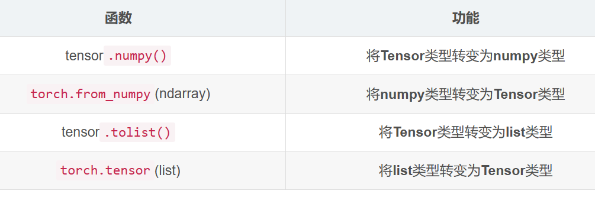
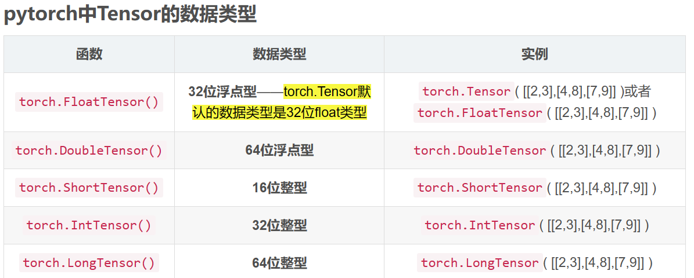

# C-1     
----    
----   
创建环境：>conda create -n pytorch python=3.10    
激活环境    
  
----
两个有用的学习工具箱的函数：    
dir()   
help()   
  


----
梯度下降算法：$x=x-rx'$  不断迭代，x减去原函数在x处的导数，赋值给原x，当下降到最低点时，导数为0，无法再减；r为学习速度     
常用求解器：sgd，rmsprop， adam  

精确求解：closed form solution   

-----
## 张量数据类型
-----
  

表示string数据类型：one-hot；embedding   
   

   

检查数据类型：  
   

x.cuda()返回gpu上的引用，此时数据类型变为torch.cuda.DoubleTensor   

维度为0的标量 dim0 torch.tensor(1.)    

----  
``` python
In[0]；torch.tensor(1.3)    #dim=0   标量
Out[0]: tensor(1.300000)   
```  

```python
torch.tensor([1.1])          #dim=1   有一个分量
In[1]: torch.FloatTensor(2)   #指定维度，初始化为随机数
```

从numpy引入数据
```python
data=np.ones(2)
In[2]: data
Out[2]: array([1., 1.])

In[3]: torch.from_numpy(data)
Out[3]: tensor([1., 1.], dtype=torch.float64)
```  
```
In[4]: torch.ones(2).shape
Out[4]: tensor.Size([2])
```

```python
In[5]: torch.randn(2, 3)
Out[5]: tensor([[1, 1, 1], 
                [2, 2, 2]])   #dim=2, 即shape/size的第一个数为2
In[6]: torch.size(0)
Out[6]: 2

In[7]: torch.size[1]
Out[7]: 3
```

```
In[8]: a=torch.rand(1, 2, 3)
Out[8]: tensor([[[1, 1, 1], [1, 1, 1]]])

In[9]: torch,rand(2, 2, 2)
Out[9]: tensor([[[1, 1], [1, 1]], [[1, 1], [1, 1]]])
```

```
>>> a=torch.rand(2, 2, 2)    #rand返回的是随机均匀分布的数据
>>> a[0][1]
tensor([0.3813, 0.6254])
>>> a
tensor([[[0.0572, 0.0755],
         [0.3813, 0.6254]],

        [[0.2448, 0.6599],
         [0.9110, 0.5845]]])
```

对于维度，读取方法是从右往左，从内到外     

三维的一个例子：dim=3的张量很适合用于RNN和NLP，如20句话，每句话10个单词，每个单词用100个分量的向量表示，得到的Tensor就是shape=[20,10,100]    

tensor.shape实际上返回的是一个list   

```
a.numrel()    #返回占用内存大小
a.dim()      #返回维度
```


使用from_numpy导入的float实际上是double类型   
tensor接受现成list   
  

  

创建tensor一览：  
```
torch.zeros(size=(1, 2, 3), out=None, dtype=torch.float32)      #全为0
torch.randn(size=(4, 5), dtype=torch.float32)   #标准正态分布
torch.rand(3,2)     #从0-1均匀分布
torch.normal(means, std, out=None)    #离散正态分布
torch.linspace(start, end, steps=100, out=100)    #线性间距向量
```
佬的实验：
```python
#备注：
#torch.IntTensor(2, 4).zero_() 与torch.zeros(2,4).int()的效果相同，均得到一个2*4的填充元素均为零的Tensor。
```


torch.empty()和torch.zeros()区别
```python
torch.empty(*size, out=None, dtype=None, layout=torch.strided, device=None, requires_grad=False, pin_memory=False) 

# 可以指定生成类型，设备和其它参数
#Returns a tensor filled with uninitialized data（未初始化的数）. The shape of the tensor is defined by the variable argument :attr:size.

torch.zeros(*size, out=None, dtype=None, layout=torch.strided, device=None, requires_grad=False)

#Returns a tensor filled with the scalar value 0（标准值0）, with the shape defined by the variable argument :attr:size.
```


### ***torch.tensor和torch.Tensor的区别***  

tensor实际上是python函数：  
```python
torch.tensor(data, dtype=None, device=None, requires_grad=False)
```
其中data可以是list, tuple, array, scalar等。tensor函数生成相应的tensor数据类型  

Tensor则是python，torch.Tensor(3, 5)这样仅指定生成Tensor的shape时，将默认生成填充值均为0的单精度浮点类型的张量。Tensor只能指定生成数据类型为torch.float （实质上是FloatTensor）

FloatTensor为默认   
IntTensor  

## 随机抽样 torch.random


```python
a=torch.rand(3, 3)
torch.rand_like(a)   #读取a的维度，再给rand()
torch.randint(1, 10, [3, 3])    #最小值，最大值，shape，生成整数

torch.randn()   #生成的是均值为0， 方差为1的标准正态分布随机数
#如果要指定均值和方差，用torch.normal()
torch.normal(mean=   , std=     , )

torch.full()
torch.arange()
```


