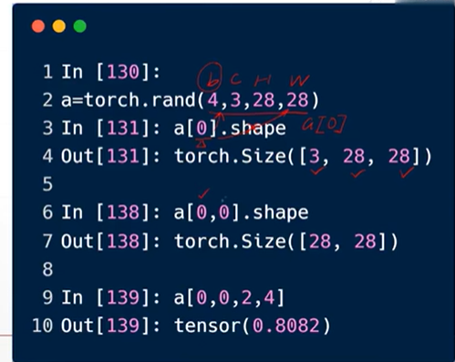
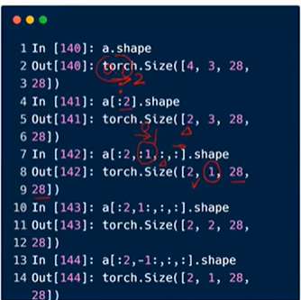
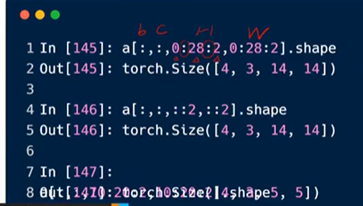

# C-2
## 索引
  

a[0, 2, 2, 4]也可以写成a[0][2][2][4]   

即索引从最开始的维度，最大的维度开始  

```python
a[:2].shape()     #0到2，不包含2的图片
```
   

还有隔行采样（0:28=0:28:1，其实是步长）：  
  
[::2]步长为2，从头到尾   

似乎shape是tensor数据类型的一个属性，返回的是torch.Size(),应该是一个类    

```python
a.index_select(0, torch.tensor([2, 3]))  #获取第一个维度的索引号为2和3的张量子集
```

torch.index_select(input, dim=  , index=  , out=None) 

input(Tensor) - 需要进行索引操作的输入张量；  
dim(int) - 需要对输入张量进行索引的维度；  
index(LongTensor) - 包含索引号的 1D 张量, 必须是1维张量！！！！  
out(Tensor, optional) - 指定输出的张量。比如执行 torch.zeros([2, 2], out = tensor_a)，相当于执行 tensor_a = torch.zeros([2, 2])；

```python
import torch
 
a = torch.rand(4, 3, 28, 28)
 
# 等与a
print(a[...].shape)
 
# 第一张图片的所有维度
print(a[0, ...].shape)
 
# 所有图片第二通道的所有维度
print(a[:, 1, ...].shape)
 
# 所有图像所有通道所有行的第一、第二列
print(a[..., :2].shape)
```

mask_select  选择大于某数的元素
```python
# 生成a这个Tensor中大于0.5的元素的掩码
mask = a.ge(0.5)
print(mask)
 
# 取出a这个Tensor中大于0.5的元素
val = torch.masked_select(a, mask)
print(val)
print(val.shape)
```

torch.arange()生成$\frac{end-start}{step}$的1维张量，值介于$[start, end)$之间
```python
arange(start=0, end, step=1, *, out=None, dtype=None, layout=torch.strided, device=None, requires_grad=False)
```


