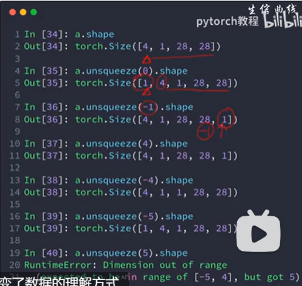

# C-3
## 维度变换

### *重塑维度*

tensor.view()   
按照行优先的顺序重新排成一行，再按照指定的格式组合   
```python
a=torch.Tensor([[[1,2,3],[4,5,6]]])
b=torch.Tensor([1,2,3,4,5,6])

print(a.view(1,6))  # tensor([[1., 2., 3., 4., 5., 6.]]) 
print(b.view(1,6))  # tensor([[1., 2., 3., 4., 5., 6.]]) 

a=torch.Tensor([[[1,2,3],[4,5,6]]])
print(a.view(3,2)) 
tensor([[1., 2.],
         [3., 4.],
         [5., 6.]])  
#相当于就是从 1，2，3，4，5，6 顺序的拿数组来填充需要的形状。
```

### 交换维度 tensor.permute

```python
a = torch.randn(2, 3, 4) # torch.Size([2, 3, 4])
b = a.permute(2, 0, 1)   # torch.Size([4, 2, 3])
```

### 压缩和增加维度 tensor.squeeze/tensor.unsqeeze

  

没有改变数据本身，改变了数据的理解方式

unsqeeze(0)是在第一个维度之前插入，unsqeeze(-1)是在最后一个维度之后插入，对于没有的维度，不会增加什么，范围是-n~n-1      

torch.expand()    
只能对包含维度为1的张量进行拓展，即必须是torch.Size([1, n])/torch.Size([n, 1])   


新扩展维度的取值范围为：− 1 以 及 [ 1 , + ∞ ] 区 间 内 的 任 意 整 数 -1以及[1, +∞]区间内的任意整数−1以及[1,+∞]区间内的任意整数，例如：将 torch.Size([1, n]) 扩展为torch.Size([m, n])时，新扩展维度 m 的可能取值为-1，或者 m ≥ 1的任意整数；

```python
a = torch.tensor([[2], [3], [4]])
print("a:\n", a)
print(a.size())
>>>
a:
 tensor([[2],
        [3],
        [4]])
torch.Size([3, 1])
# 将新扩展维度m置0时，原tensor变为空张量。
a.expand(3,0)
>>>
tensor([], size=(3, 0), dtype=torch.int64)
```

tensor.repeat()


### *转置torch.t()/torch.transpose()*

t()为transpose()简写版本，只能对2维以下的tensor转置  
T()为permute()简化版本，可以对任意n维tensor转置


## broadcast
没看


## 合并和分割
torch.cat([a, b], dim=?， axis=0/1)    
?: 在哪个维度上合并，其余除该维度和0维度之外的必须一样   
axis为0是按行拼接，1是按列  
还存有疑惑。。。。。    


torch.stack()  
创建新的维度，所有维度必须一样  

torch.split(num, dim=?)   
num:拆分的长度；dim：操作的维度    

或者num换成list，例如[3, 2]


## 运算

乘法：torch.mm(), torch.matmul(), a@b   

乘方：power   

开方：rsqrt

累乘: prod()  

argmax/argmin(dim=)：返回每个维度内部最大最小值索引  
max/min则是返回值，用法同上  

torch.full(size, num)  

torch.exp()和torch.log()  

floor向下取整， ceil向上取整， trunc整数部分，frac小数部分， round四舍五入   

clamp裁剪：


