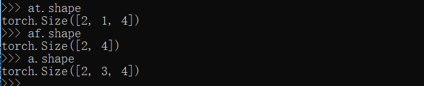
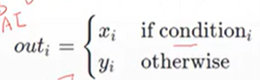

# C-4
## 属性统计
范数：   

向量p范数：norm()求p范数  
  

矩阵1范数（列模）  
  

矩阵2范数（谱模）   
   
其中$\lambda$为特征值  

矩阵$\infty$范数（行模）  
  


norm()求范数,norm(1)1范数，（2）2范数，  
dim
```python
a = torch.rand((2,3,4))
at = torch.norm(a,p=2,dim=1,keepdim=True)   #保持维度
af = torch.norm(a,p=2,dim=1,keepdim=False)  #不保持维度
 
print(a.shape)
print(at.shape)
print(af.shape)
```
  

keepdim
```python
import torch
import torch.tensor as tensor
 
a = tensor([[1, 2, 3, 4],
        [1, 2, 3, 4]]).float()  #norm仅支持floatTensor,a是一个2*4的Tensor
a0 = torch.norm(a,p=2,dim=0)    #按0维度求2范数
a1 = torch.norm(a,p=2,dim=1)    #按1维度求2范数
print(a0)
print(a1)
```
  


## 高级操作
    

   

另一个gather()查表操作    


