# C-5
## 损失函数
神经网络的学习过程就是最小化损失函数的过程。一般损失函数为MSE(mean squared error)或交叉熵误差(cross entropy error)等代替。  

用梯度下降算法更新参数：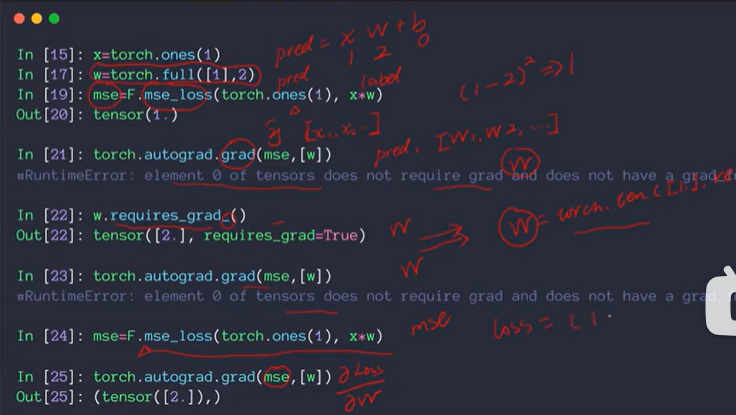  
先用require_grad设置为可以求导，再算损失函数mse_loss, 最后调用autograd.grad()  

另一种方法：loss.backward()  
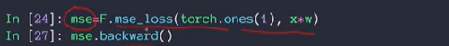  

## Loss与激活函数

激活函数sigma：torch.sigmoid(), 或from torch.nn import functional as F; torch.tanh()   

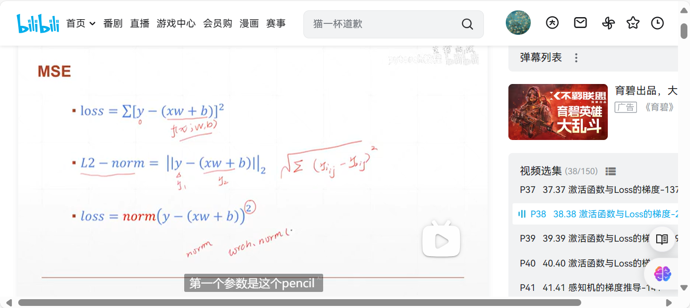  
没懂    

autograd.grad(outputs, inputs, grad_outputs=None, retain_graph=None, create_graph=False, only_inputs=True, allow_unused=False)对输入变量进行求导

## torch.util.data()

各个参数含义：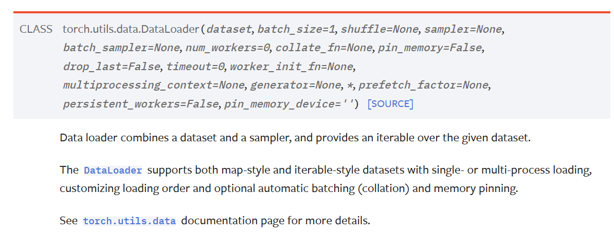    

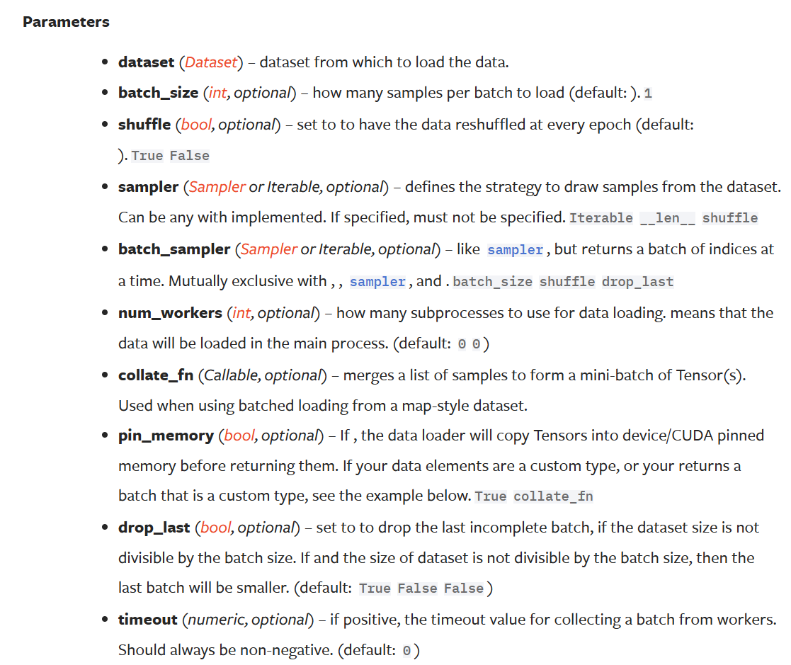  

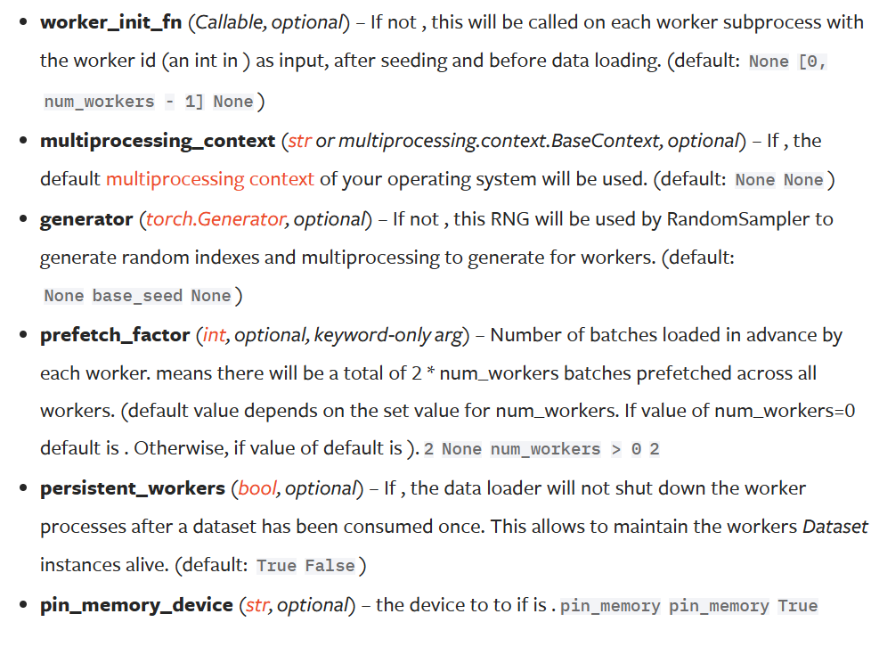  

卷积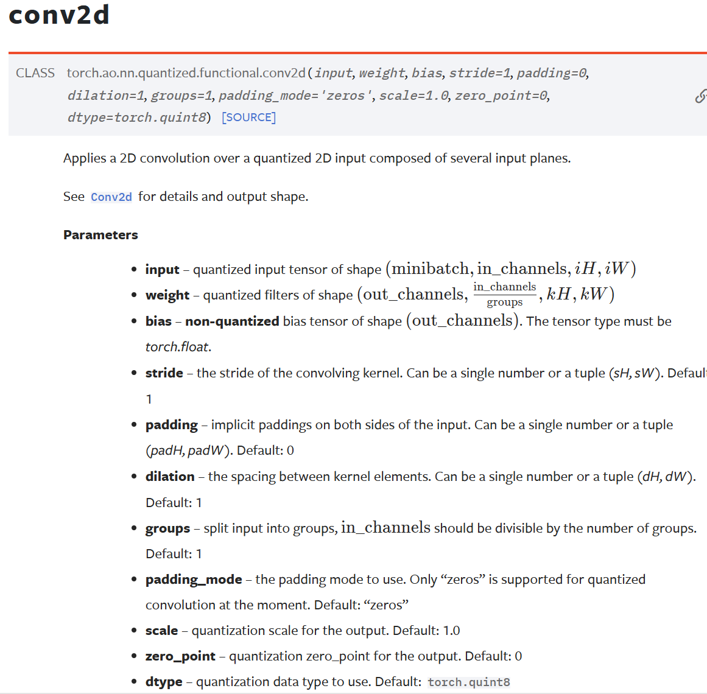  

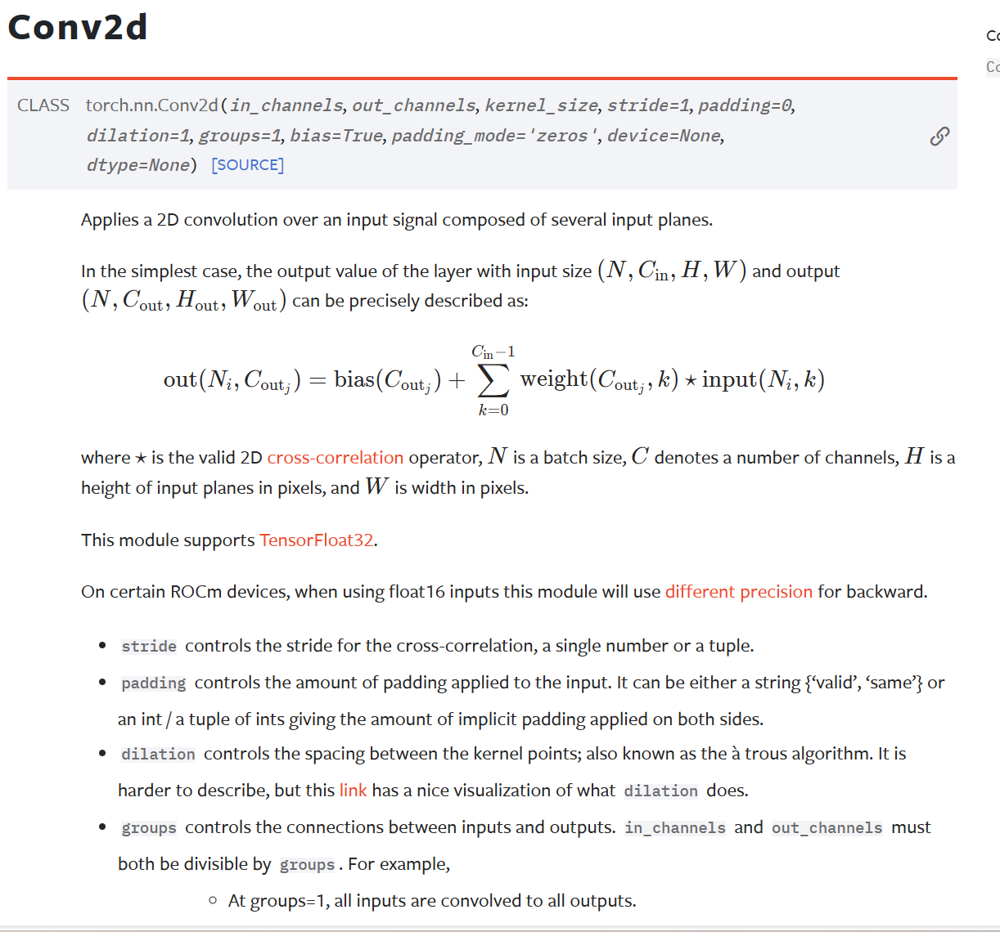  

各个参数：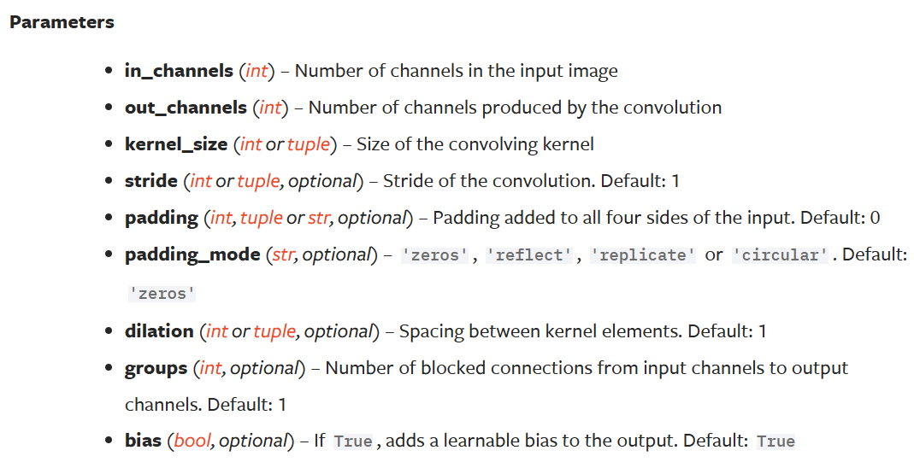  

container：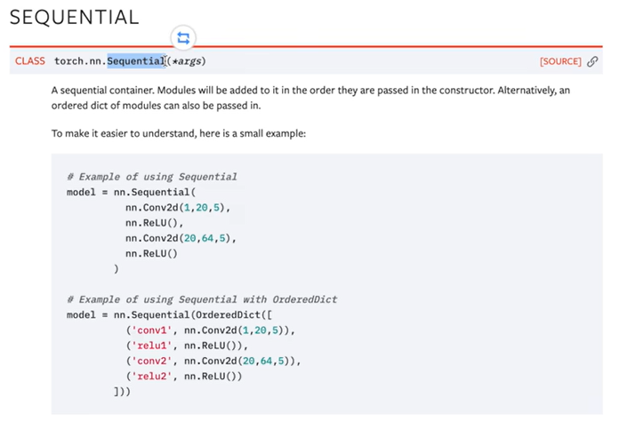  

## Dataloader/Dataset

## torch.optim

Adam/AdamW  
学习率调整优化器：torch.optim.lr_scheduler.ReduceLROnPlateau(optimizer, mode=‘min’, factor=0.1, patience=10, verbose=False, threshold=0.0001, threshold_mode=‘rel’, cooldown=0, min_lr=0, eps=1e-08)  
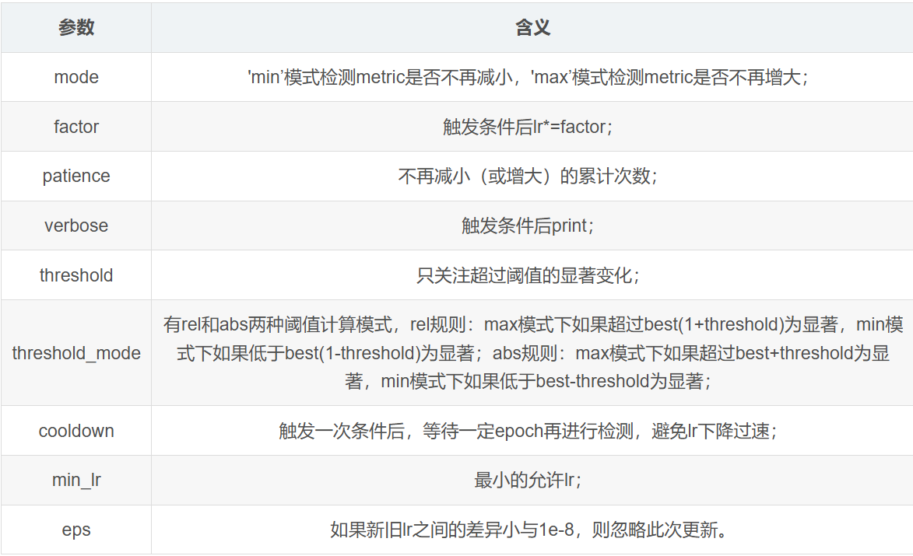  

