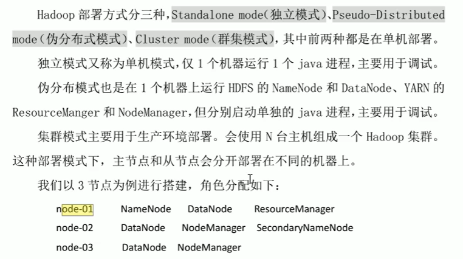

# Haoop2.0集群简介

一个用java语言实现的开源软件框架  
允许使用简单的编程框架在计算机集群上对大规模数据集进行分布式处理     

HDFS(Hadoop Distributed Files System): Hadoop的分布式文件系统————解决大量数据存储问题   

MapReduce（运行在yarn上的分布式运算编程框架）: 数据处理   
Yarn（作业调度和集群资源管理框架）: 集群资源管理和资源任务调度   

HDFS集群中的角色有：NameNode, DataNode, SecondaryNameNode   

Yarn集群中的角色: ResourceManager, NodeManager   

MapReduce: 编程框架，运行在HDFS上， 受YARN调度  

Hadoop部署方式：Standalone mode独立模型，Pseudo-Distributed mode伪分布模式，Cluster mode群集模式    
  

